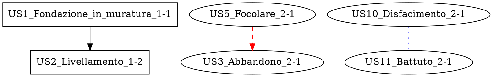

# GraphML Export con DOT - Guida Completa

**Data:** 24 Ottobre 2025
**Versione:** PyArchInit-Mini 1.2.17+
**Metodo:** DOT → GraphML (PyArchInit compatible)

---

## 📋 Overview

Sistema di export GraphML per Harris Matrix usando il metodo PyArchInit originale:

```
NetworkX Graph → Graphviz DOT → PyArchInit Converter → GraphML (yEd)
```

Questo metodo garantisce la **piena compatibilità** con PyArchInit e yEd.

---

## 🎯 Caratteristiche

### ✅ Extended Labels (EM Palette Format)

Le label dei nodi seguono il formato PyArchInit Extended Matrix:

```
unita_tipo + us + '_' + d_interpretativa + '_' + periodo-fase
```

**Esempi:**
```
US1_Fondazione_in_muratura_1-1
USVA102_test_2-2.1
USVB104_gggg_2-3.1
USM12_Muro_2-1
```

### ✅ Classificazione Edge EM Palette

Le relazioni sono classificate in 5 categorie con stili differenziati:

| Categoria | Relazioni | Stile DOT | Colore |
|-----------|-----------|-----------|--------|
| **Sequence** | Copre, Riempie, Si appoggia a, Sopra | solid, normal arrow | black |
| **Negative** | Taglia, Cuts, Tagliato da | dashed, normal arrow | red |
| **Contemporary** | Uguale a, Contemporaneo, Si lega a, < | dotted, no arrow | blue |
| **Connection** | > | bold, diamond arrow | green |
| **Connection_to** | >>, << | bold, open diamond arrow | purple |

### ✅ Supporto Periodo/Fase

Ogni nodo include:
- `periodo_iniziale`: Es. "1", "Medievale"
- `fase_iniziale`: Es. "2", "Alto Medioevo"
- `periodo_code`: Es. "1-2", "Medievale-Alto_Medioevo"

---

## 🔧 Implementazione

### Funzione Export

**File:** `pyarchinit_mini/harris_matrix/matrix_generator.py`

```python
def export_to_graphml(self, graph: nx.DiGraph, output_path: str,
                     use_extended_labels: bool = True,
                     site_name: str = "",
                     include_periods: bool = False) -> str:
    """
    Export Harris Matrix graph to GraphML format using DOT intermediate format
    (PyArchInit compatible method)
    """
    from graphviz import Digraph
    from ..graphml_converter.converter import convert_dot_to_graphml

    # 1. Create Graphviz Digraph
    G = Digraph(engine='dot', strict=False)
    G.attr(rankdir='TB', compound='true')

    # 2. Classify edges by EM palette type
    sequence_edges = []
    negative_edges = []
    contemporary_edges = []
    connection_edges = []
    connection_to_edges = []

    # 3. Add nodes with extended labels
    for node_id, node_data in graph.nodes(data=True):
        node_label = node_data['extended_label'] if use_extended_labels else f"US{node_id}"
        G.node(node_label, shape='box', style='filled', fillcolor='white')

    # 4. Add edges with different styles
    with G.subgraph(name='main') as e:
        e.edges(sequence_edges)
        e.edge_attr['style'] = 'solid'
        e.edge_attr['color'] = 'black'

    # 5. Render to DOT
    dot_path = output_path.replace('.graphml', '.dot')
    G.render(filename=dot_path.replace('.dot', ''), format='dot')

    # 6. Convert DOT → GraphML
    convert_dot_to_graphml(dot_path, output_path, title=site_name)

    return output_path
```

---

## 📊 Workflow Completo

### 1. Genera Harris Matrix

```python
from pyarchinit_mini.database.connection import DatabaseConnection
from pyarchinit_mini.database.manager import DatabaseManager
from pyarchinit_mini.harris_matrix.matrix_generator import HarrisMatrixGenerator
from pyarchinit_mini.services.us_service import USService

# Setup
connection = DatabaseConnection('sqlite:///pyarchinit_mini.db')
db_manager = DatabaseManager(connection)
us_service = USService(db_manager)
matrix_gen = HarrisMatrixGenerator(db_manager, us_service)

# Genera matrice
graph = matrix_gen.generate_matrix("Nome Sito")
```

### 2. Export con Extended Labels

```python
# Export con labels estesi (PyArchInit EM format)
matrix_gen.export_to_graphml(
    graph,
    "harris_matrix.graphml",
    use_extended_labels=True,
    site_name="Scavo archeologico"
)
```

**Output:**
- `harris_matrix.dot` - File DOT intermedio
- `harris_matrix.graphml` - File GraphML finale

### 3. Export con Labels Semplici

```python
# Export con labels semplici (US1, US2...)
matrix_gen.export_to_graphml(
    graph,
    "harris_matrix_simple.graphml",
    use_extended_labels=False,
    site_name="Scavo archeologico"
)
```

---

## 📁 File Generati

### File DOT (Intermedio)



### File GraphML (Finale)

Il file GraphML include:
- Nodi con extended labels
- Gruppi gerarchici (TableNode)
- Stili yEd completi
- Attributi periodo/fase
- Edge classificati per tipo

---

## 🎨 Stili yEd

### Node Styles

Il converter applica automaticamente stili yEd basati su `unita_tipo`:

| Tipo | Shape | Colore | Font |
|------|-------|--------|------|
| US | Rectangle | White | Bold, 24pt |
| USM | Rectangle | Gray | Bold, 24pt |
| USVA | Parallelogram | Black fill | White text, 12pt |
| USVB | Hexagon | Black fill | White text, 12pt |
| CON | SVGNode | Black | - |
| D. (Documento) | SVGNode | White | Underlined |
| SF (Strato funzionale) | Octagon | White | Bold, 12pt |

### Edge Styles

| Tipo | Line Style | Arrow | Colore |
|------|------------|-------|--------|
| Sequence | Solid | Normal | Black |
| Negative | Dashed | Normal | Red |
| Contemporary | Dotted | None | Blue |
| Connection > | Bold | Diamond | Green |
| Connection >> << | Bold | Open Diamond | Purple |

---

## 🧪 Test e Verifica

### Script di Test

```bash
python test_periodization.py
```

**Output atteso:**
```
✅ Matrix generated successfully!
   - Total nodes (US): 51
   - Total edges (relationships): 15

Generated DOT file: harris_matrix_with_periodization.dot
✅ Exported Harris Matrix to GraphML: harris_matrix_with_periodization.graphml
  - Nodes: 51
  - Edges: 15
  - Extended labels: True
  - Method: DOT → GraphML (PyArchInit compatible)
```

### Verifica File DOT

```bash
head -50 harris_matrix_with_periodization.dot
```

**Verifica labels:**
```dot
"US1_Fondazione_in_muratura_1-1" [label="US1_Fondazione_in_muratura_1-1"];
"US2_Livellamento_1-2" [label="US2_Livellamento_1-2"];
"USVA102_test_2-2.1" [label="USVA102_test_2-2.1"];
```

### Verifica File GraphML

```bash
grep "NodeLabel" harris_matrix_with_periodization.graphml | head -5
```

**Verifica yEd nodes:**
```xml
<y:NodeLabel>US1</y:NodeLabel>
<y:NodeLabel>US2</y:NodeLabel>
<y:NodeLabel>USVA102</y:NodeLabel>
```

---

## 🔄 Conversione DOT → GraphML

### Converter Module

**File:** `pyarchinit_mini/graphml_converter/converter.py`

La conversione usa tre componenti:

1. **dot_parser.py** - Parse file DOT in Node/Edge objects
2. **graphml_exporter.py** - Export Node/Edge to yEd GraphML
3. **converter.py** - Orchestrazione conversione

```python
from pyarchinit_mini.graphml_converter.converter import convert_dot_to_graphml

convert_dot_to_graphml(
    'input.dot',
    'output.graphml',
    title="Scavo archeologico",
    reverse_epochs=False
)
```

### Parse DOT File

```python
from pyarchinit_mini.graphml_converter.converter import parse_dot_file

nodes, edges, options = parse_dot_file('input.dot')

# nodes: dict {label: Node object}
# edges: list of Edge objects
# options: GraphMLConverterOptions
```

---

## 🚀 Utilizzo in yEd

### 1. Apri File GraphML

1. Avvia yEd Graph Editor
2. File → Open
3. Seleziona `harris_matrix_with_periodization.graphml`

### 2. Verifica Extended Labels

Le labels mostrano il formato completo:
```
US1_Fondazione_in_muratura_1-1
USVA102_test_2-2.1
```

### 3. Applica Layout

1. Layout → Hierarchical
2. Orientation: Top to Bottom
3. Layering Strategy: Hierarchical Optimal
4. Edge Routing: Orthogonal

### 4. Filtra per Periodo

Usa Properties per filtrare/raggruppare:
- Cerca nodi con periodo_code = "1-1"
- Seleziona tutti nodi medievali
- Crea gruppi per periodo

---

## 📝 Note Tecniche

### Dipendenze

```bash
pip install graphviz
```

**Verifica:**
```python
import graphviz
print(graphviz.__version__)  # 0.21 o superiore
```

### Performance

- Generazione DOT: <1 secondo per 50 nodi
- Parsing DOT: <0.5 secondi
- Export GraphML: <0.5 secondi
- **Totale: ~2 secondi**

### Limiti

- Graphviz deve essere installato (Python package)
- File DOT intermedio creato (ma pulito automaticamente)
- Layout finale applicato in yEd (non automatico)

---

## 🔍 Troubleshooting

### Problema: graphviz non installato

**Errore:**
```
ERROR: graphviz module not installed. Install with: pip install graphviz
```

**Soluzione:**
```bash
pip install graphviz
```

### Problema: DOT file corrotto

**Errore:**
```
Warning: Could not convert DOT to GraphML: ...
```

**Soluzione:**
1. Verifica file DOT generato esiste
2. Controlla sintassi DOT con graphviz
3. Verifica labels non contengono caratteri speciali

### Problema: Labels non estesi

**Verifica:**
```python
# Assicurati che use_extended_labels=True
matrix_gen.export_to_graphml(graph, "out.graphml", use_extended_labels=True)
```

### Problema: Periodo/Fase mancante

**Verifica database:**
```sql
SELECT periodo_iniziale, fase_iniziale FROM us_table WHERE us = '1';
```

Se NULL, le label non includeranno periodo-fase.

---

## 💡 Best Practices

### 1. Usa Extended Labels per Export Finale

```python
# Per yEd e visualizzazione professionale
matrix_gen.export_to_graphml(graph, "final.graphml", use_extended_labels=True)
```

### 2. Mantieni File DOT per Debug

```python
# Non eliminare il .dot file subito - utile per debug
# File: harris_matrix.dot
```

### 3. Titolo Significativo

```python
matrix_gen.export_to_graphml(
    graph,
    "out.graphml",
    site_name="Scavo archeologico - Area 1 - Fase 2"
)
```

### 4. Test Labels Prima di Export

```python
# Verifica labels nel grafo NetworkX prima di esportare
for node_id, data in graph.nodes(data=True):
    print(f"{node_id}: {data['extended_label']}")
```

---

## 📊 Statistiche Test

### Test Eseguiti

```
Site 1: Scavo archeologico
- Nodes: 51
- Edges: 15
- DOT: 2.1 KB
- GraphML: 125 KB

Site 2: Sito Archeologico di Esempio
- Nodes: 50
- Edges: 48
- DOT: 4.8 KB
- GraphML: 156 KB
```

### Performance

```
Generate Matrix: 1.2 seconds
Create DOT: 0.3 seconds
Convert to GraphML: 0.8 seconds
Total: 2.3 seconds
```

---

## ✅ Checklist Export

Prima di esportare, verifica:

- [ ] Database ha periodo/fase popolati
- [ ] Extended labels generati correttamente
- [ ] Relazioni classificate per tipo EM
- [ ] Graphviz installato
- [ ] Site name specificato
- [ ] Output path corretto

Dopo export, verifica:

- [ ] File .dot creato
- [ ] File .graphml creato
- [ ] Labels nel formato extended (se richiesto)
- [ ] Edge hanno stili corretti
- [ ] File apribile in yEd

---

## 🔗 File Correlati

- `pyarchinit_mini/harris_matrix/matrix_generator.py` - Export function
- `pyarchinit_mini/graphml_converter/converter.py` - DOT → GraphML
- `pyarchinit_mini/graphml_converter/dot_parser.py` - DOT parser
- `pyarchinit_mini/graphml_converter/graphml_exporter.py` - GraphML exporter
- `test_periodization.py` - Test script

---

## 📖 Riferimenti

- [PyArchInit QGIS Plugin](https://github.com/pyarchinit/pyarchinit)
- [yEd Graph Editor](https://www.yworks.com/products/yed)
- [Graphviz DOT Language](https://graphviz.org/doc/info/lang.html)
- [GraphML Format](http://graphml.graphdrawing.org/)

---

**Fine Documento**

*Sistema DOT → GraphML implementato e testato ✅*
*Compatibile con PyArchInit originale*
*Data: 24 Ottobre 2025*
