# PyArchInit-Mini Web GUI - Complete Tutorial

**Version**: 1.7.13
**Last Updated**: 2025-10-29

This tutorial provides a complete visual walkthrough of the PyArchInit-Mini Web interface, covering all features, forms, and functions.

---

## Table of Contents

1. [Getting Started](#getting-started)
2. [Dashboard](#dashboard)
3. [Site Management](#site-management)
4. [Stratigraphic Units (US)](#stratigraphic-units-us)
5. [Material Inventory](#material-inventory)
6. [Harris Matrix](#harris-matrix)
7. [Harris Matrix Creator](#harris-matrix-creator)
8. [Data Import/Export](#data-importexport)
9. [Extended Matrix Configuration](#extended-matrix-configuration)
10. [Analytics](#analytics)
11. [Validation](#validation)
12. [Administration](#administration)

---

## Getting Started

### System Requirements

- Python 3.8+
- Modern web browser (Chrome, Firefox, Safari, Edge)
- SQLite or PostgreSQL database

### Starting the Web Server

```bash
# Start with default database
pyarchinit-mini-web

# Start with specific database
DATABASE_URL="sqlite:///data/pyarchinit_mini.db" python3 -m pyarchinit_mini.web_interface.app

# Start on custom port
PYARCHINIT_WEB_PORT=8080 pyarchinit-mini-web
```

The web interface will be available at: **http://localhost:5001**

### Authentication

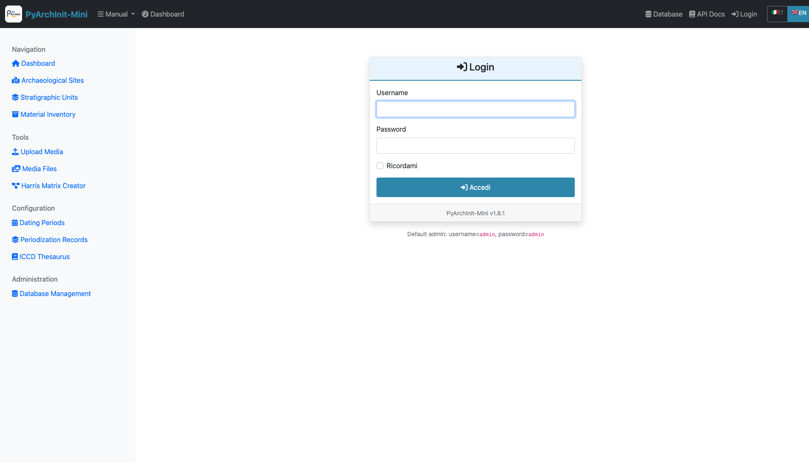

The login page is the entry point to PyArchInit-Mini Web GUI.

**Default Credentials:**
- Username: `admin`
- Password: `admin`

**Login Process:**

1. Enter your username in the username field
   

2. Enter your password in the password field
   

3. Click the Login button to access the system
   

**Security Features:**
- Session-based authentication
- Role-based access control (Admin, Operator, Viewer)
- Secure password hashing with bcrypt
- Auto-logout on browser close

---

## Dashboard

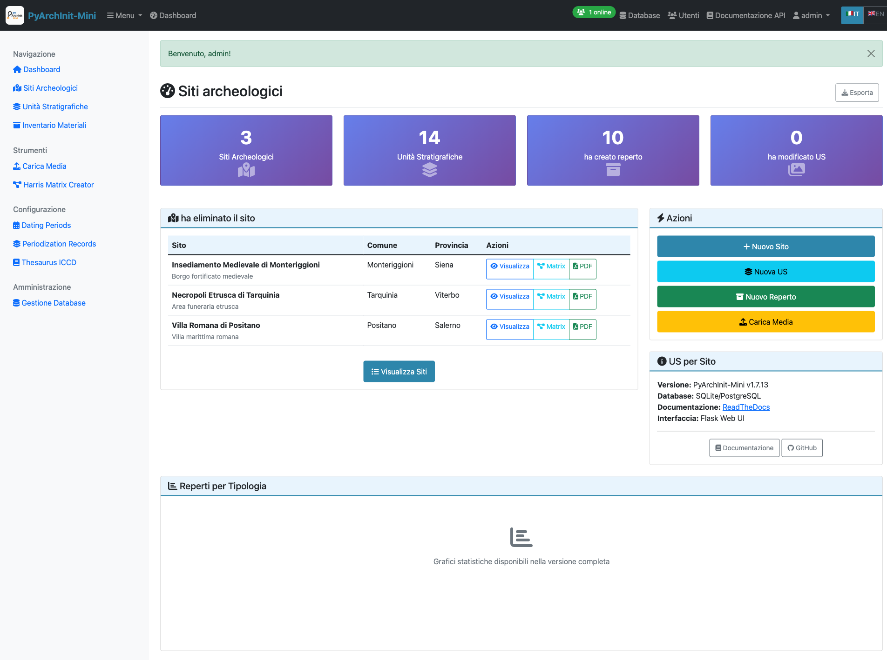

After logging in, you'll see the main dashboard with:

### Key Features

**Statistics Cards:**
- Total Sites count
- Total Stratigraphic Units (US)
- Total Inventory Items
- Database information
- System version

**Recent Activity:**
- Latest created sites
- Recent stratigraphic units
- Recent inventory additions

**Quick Navigation:**
- Access all major modules from the top navigation menu
- Responsive design adapts to screen size
- Real-time statistics updates

**System Information:**
- Database type (SQLite/PostgreSQL)
- Database path
- Application version (1.7.13)
- Server status

---

## Site Management

Sites are the top-level organizational units in PyArchInit-Mini, representing archaeological sites or excavation areas.

### Site List

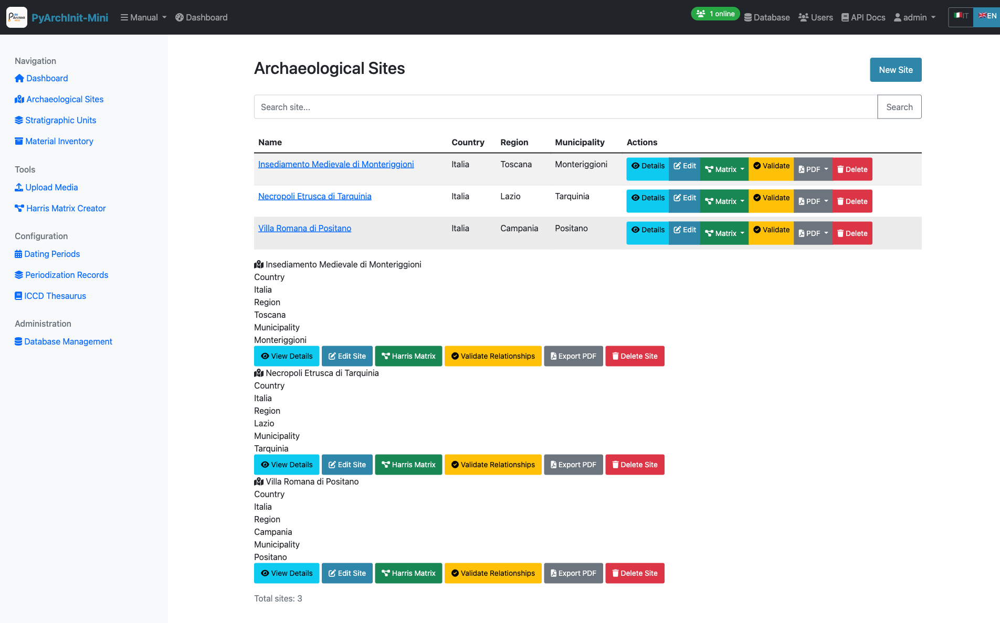

**Features:**
- Paginated list of all sites (20 per page)
- Search by site name
- Quick view of site location (Nation, Region, Province, Municipality)
- Direct links to site details
- Create new site button

### Site Detail View

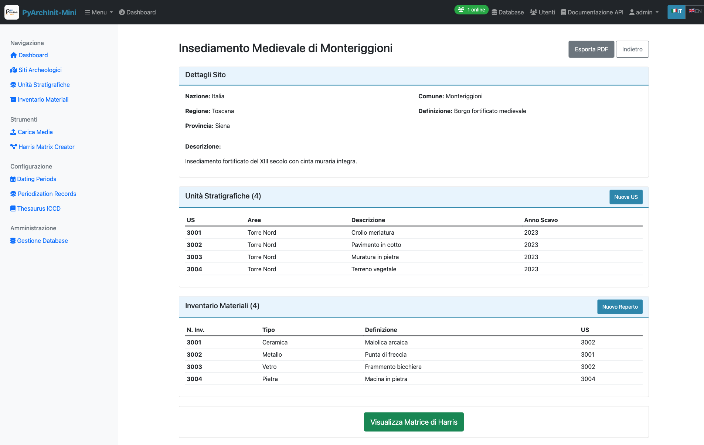

The site detail page shows:
- Complete site information
- Associated stratigraphic units
- Related inventory items
- Geographic location details
- Edit and delete options

### Creating a New Site

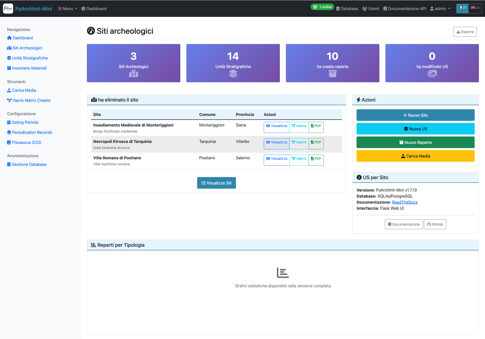

**Required Fields:**
- Site Name (Nome Sito)

**Optional Fields:**
- Nation (Nazione)
- Region (Regione)
- Province (Provincia)
- Municipality (Comune)
- Site Definition (Definizione Sito)
- Description (Descrizione)
- English translations for site definition and description

**Form Features:**
- Client-side validation
- i18n support (Italian/English)
- Auto-save draft functionality
- Cancel to return to list

---

## Stratigraphic Units (US)

The US (Unità Stratigrafiche) module manages stratigraphic units with comprehensive archaeological data across 6 organized tabs.

### US List

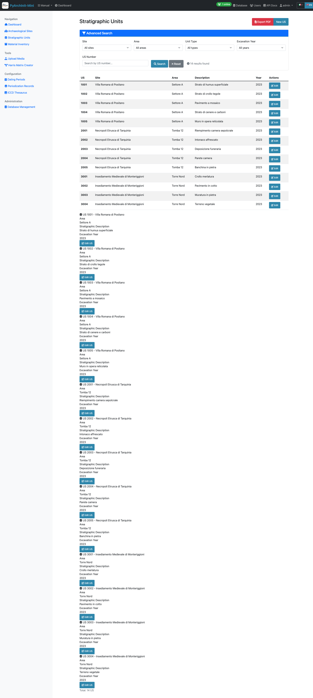

**Features:**
- Paginated list with advanced filtering
- Filter by site, area, unit type, year
- Quick view of US number, site, and area
- Color-coded by unit type
- Bulk operations support

### Creating a New US

The US form is organized into **6 tabs** for better data organization:

#### Tab 1: Basic Information


**Fields:**
- Site (required) - Select from dropdown
- US Number (required) - Unique identifier
- Area
- Stratigraphic Description
- Interpretative Description
- Formation Type (Natural/Artificial)
- Year of Excavation
- Archaeologist

#### Tab 2: Physical Characteristics


**Fields:**
- Unit Type (e.g., Layer, Cut, Fill)
- Color
- Consistency
- Texture
- Compaction
- Inclusions
- Soil composition details

#### Tab 3: Relationships


**Stratigraphic Relationships:**
- Covers (Copre)
- Covered by (Coperto da)
- Cuts (Taglia)
- Cut by (Tagliato da)
- Fills (Riempie)
- Filled by (Riempito da)
- Equals (Uguale a)
- Adjacent to (Si appoggia a)

**Text Format:**
```
copre 1002, taglia 1005, si appoggia a 1010
```

These relationships are used to automatically generate the Harris Matrix.

#### Tab 4: Documentation


**Fields:**
- Detailed description (long text)
- Interpretation notes
- Bibliography references
- Archaeological finds summary
- Special observations

#### Tab 5: Dimensions & Measurements


**Fields:**
- Length (cm)
- Width (cm)
- Depth/Thickness (cm)
- Volume (cubic meters)
- Surface area (square meters)
- Elevation values (top/bottom)

#### Tab 6: Dating & Chronology


**Fields:**
- Chronological Period (from Datazioni table)
- Dating Method
- Terminus Post Quem (TPQ)
- Terminus Ante Quem (TAQ)
- Absolute dating
- Relative chronology notes

### Advanced Features

**Navigation:**
- Previous/Next buttons to navigate between records
- Position counter (e.g., "Record 5 of 20")
- Respects active filters

**Data Validation:**
- Required field checking
- US number uniqueness validation
- Relationship syntax validation
- Date format validation

---

## Material Inventory

The Inventario module manages archaeological finds and materials with **8 specialized tabs**.

### Inventory List

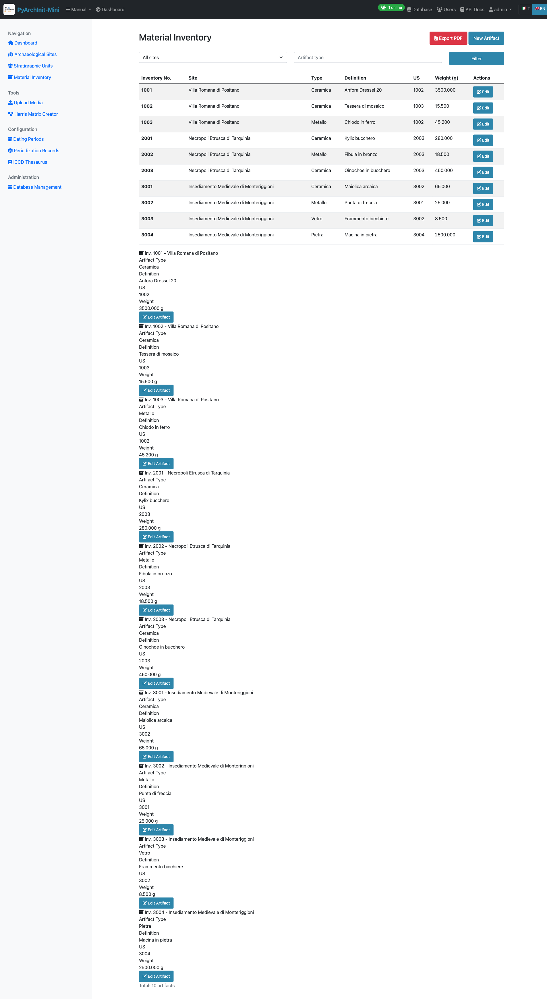

**Features:**
- Paginated list with filters
- Filter by site, area, US, find type
- Material type icons
- Conservation state indicators
- Quick search by inventory number

### Creating a New Inventory Item

The inventory form spans **8 comprehensive tabs**:

#### Tab 1: Identification


**Fields:**
- Site (required)
- Inventory Number (required)
- Find Type (Ceramica, Metallo, Pietra, Osso, Vetro, etc.)
- Definition
- Object Type
- Area
- Associated US

#### Tab 2: Physical Description


**Fields:**
- Material
- Technique
- Color description
- Dimensions (length, width, height, diameter)
- Weight (grams)
- Thickness (mm)

#### Tab 3: Conservation


**Fields:**
- Conservation State (Ottimo, Buono, Discreto, Mediocre, Pessimo)
- Completeness percentage
- Degradation type
- Restoration needed
- Conservation notes

#### Tab 4: Decoration & Style


**Fields:**
- Decoration technique
- Decoration description
- Decorative motifs
- Style attribution
- Artistic period

#### Tab 5: Context & Dating


**Fields:**
- Archaeological context
- Chronological period
- Cultural attribution
- Functional category
- Use interpretation

#### Tab 6: Documentation


**Fields:**
- Detailed description
- Bibliography
- Comparanda
- Notes
- Special observations

#### Tab 7: Media & Files


**Features:**
- Photo uploads
- Drawing attachments
- 3D model links
- Document attachments
- Media gallery viewer

#### Tab 8: Administrative


**Fields:**
- Storage location
- Current location
- Cataloguer name
- Catalog date
- Last modification
- Ownership notes

---

## Harris Matrix

The Harris Matrix visualization tool generates and displays stratigraphic relationships automatically.

### Harris Matrix View


**Features:**
- Automatic generation from US relationships
- Topological sorting (chronological sequence)
- Directed Acyclic Graph (DAG) visualization
- Level-based layout
- Node grouping by depth

**Statistics:**
- Total nodes (US count)
- Total relationships/edges
- Matrix depth (levels)
- Isolated nodes
- Top-level nodes
- Bottom-level nodes

**Visualization Options:**
- Matplotlib rendering
- PNG export
- Zoom and pan controls
- Print-friendly format

### GraphML Export


**Export Features:**
- GraphML format for yEd Graph Editor
- Preserves all relationships
- Node attributes included
- Edge styling compatible with yEd
- Downloadable file

**Use Cases:**
- Import into yEd for advanced editing
- Publish in research papers
- Archive with project data
- Share with collaborators

---

## Harris Matrix Creator

Interactive graphical editor for creating and editing Harris matrices.


**Features:**
- Drag-and-drop node creation
- Visual relationship drawing
- Node editing inline
- Auto-layout options
- Real-time validation

**Tools:**
- Add Node button
- Connect Nodes tool
- Delete Node/Edge
- Auto-arrange layout
- Zoom controls

**Validation:**
- Cycle detection
- DAG enforcement
- Duplicate prevention
- Orphan node warning

**Export Options:**
- Save to database
- Export to GraphML
- Generate PDF
- Create PNG image

---

## Data Import/Export

### Excel Import

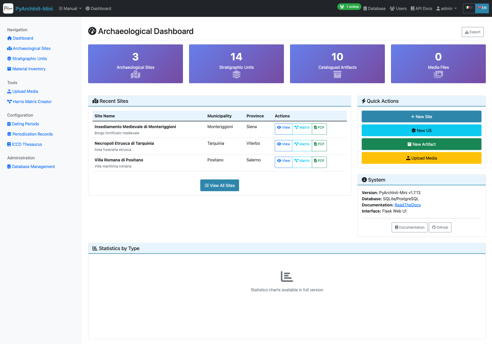

**Supported Formats:**

1. **Harris Matrix Template**
   - Two sheets: NODES and RELATIONSHIPS
   - Node properties in NODES sheet
   - Edges defined in RELATIONSHIPS sheet

2. **Extended Matrix Format**
   - Single sheet with inline relationships
   - Columns for relationship types
   - Compatible with Extended Matrix framework

**Features:**
- File upload with drag-and-drop
- Format auto-detection
- Validation before import
- Duplicate handling options
- Import statistics report
- Error logging

**Import Process:**
1. Upload Excel file (.xlsx)
2. Select format type
3. Preview data
4. Configure options (skip duplicates, overwrite, etc.)
5. Execute import
6. Review results and errors

### PyArchInit Import/Export


**Import Features:**
- Import from PyArchInit SQLite databases
- Table selection (Sites, US, Inventario, Media)
- Field mapping
- Data transformation
- Conflict resolution

**Export Features:**
- Export to PyArchInit format
- Full database export
- Selective table export
- Maintains relationships
- Compatible with PyArchInit QGIS plugin

**Use Cases:**
- Migrate from PyArchInit to PyArchInit-Mini
- Exchange data between projects
- Backup in PyArchInit format
- Integration with GIS workflows

---

## Extended Matrix Configuration

### EM Node Configuration


The Extended Matrix (EM) Node Configuration allows customization of node types and their display properties.

**Node Type Management:**
- Add custom node types
- Edit node colors and shapes
- Configure node grouping
- Set default properties

**Visual Properties:**
- Fill color
- Border color
- Border width
- Node shape (rectangle, ellipse, hexagon)
- Label position
- Font settings

**Grouping Configuration:**
- Define semantic groups (e.g., "Layers", "Cuts", "Fills")
- Set group colors
- Configure group hierarchy
- Group-based filtering

**Export Settings:**
- yEd-compatible styling
- Graphviz attributes
- DOT format options
- Color schemes

---

## Analytics

The Analytics dashboard provides comprehensive data visualization and statistics.

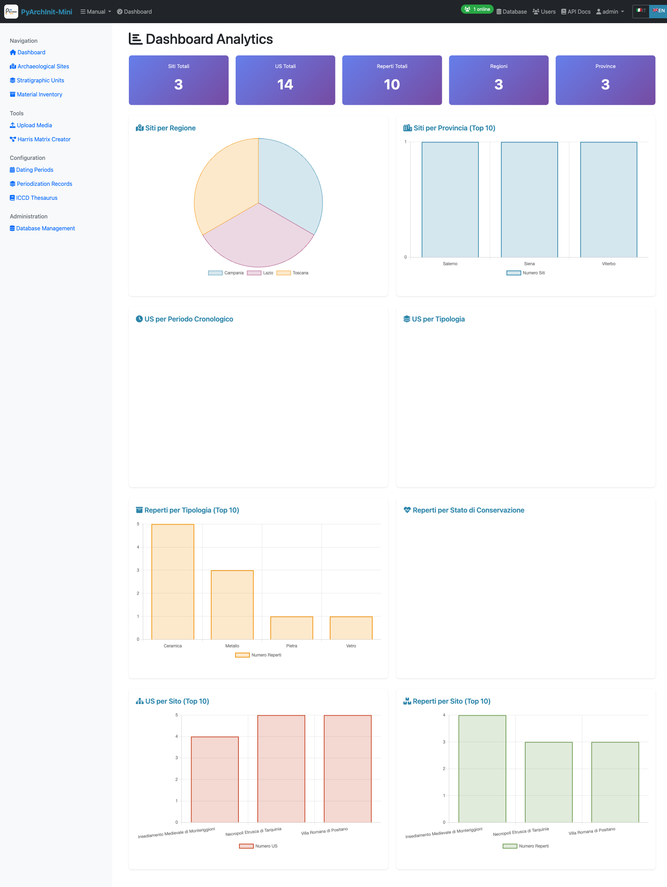

### Overview Statistics

**Top Metrics:**
- Total Sites
- Total US
- Total Inventory Items
- Unique Regions
- Unique Provinces

### Geographic Analysis

**Charts:**
- Sites by Region (Pie Chart)
- Sites by Province (Bar Chart)
- Geographic Distribution Map

### Chronological Analysis

**Visualizations:**
- US Distribution by Period (Timeline)
- Dating Certainty Analysis
- Temporal Coverage Histogram

### Typological Analysis

**US Type Distribution:**
- Unit types breakdown (Pie Chart)
- Formation types (Natural vs Artificial)
- Stratigraphic complexity metrics

**Inventory Type Distribution:**
- Material types (Ceramica, Metallo, etc.)
- Conservation states
- Completeness distribution

### Site-Level Aggregations

**Top 10 Lists:**
- Sites with most US
- Sites with most inventory items
- Most complex stratigraphic sequences

### Conservation Analysis

**Inventory Conservation:**
- Conservation state breakdown
- Restoration needs priority
- Degradation types

**Interactive Features:**
- Click charts for drill-down
- Export charts as images
- Print-friendly layouts
- Real-time data updates

---

## Validation

Stratigraphic validation ensures data quality and identifies potential issues.

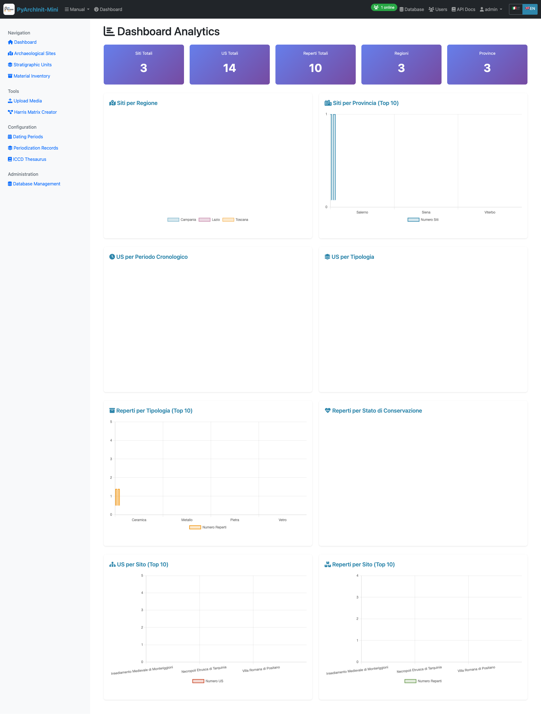

### Validation Checks

**Stratigraphic Paradoxes:**
- Circular relationships (A covers B, B covers A)
- Impossible sequences
- Inconsistent relationship types

**Cycle Detection:**
- Identify loops in the Harris Matrix
- Highlight problematic US relationships
- Suggest fixes

**Relationship Consistency:**
- Check reciprocal relationships
- Verify bidirectional consistency
- Detect missing counterparts

**Data Completeness:**
- Required fields missing
- Orphan records (US without site)
- Media without entities

### Validation Report

**Report Sections:**
1. **Summary Statistics**
   - Total issues found
   - Issues by severity (Error, Warning, Info)
   - Validation score (%)

2. **Issue Details**
   - Issue type
   - Affected records
   - Suggested fixes
   - Priority level

3. **Auto-Fix Options**
   - One-click fixes for common issues
   - Bulk resolution tools
   - Review before apply

4. **Export Report**
   - PDF report generation
   - CSV export of issues
   - Share with team

---

## Administration

Administrative functions for database and user management.

### Database Management

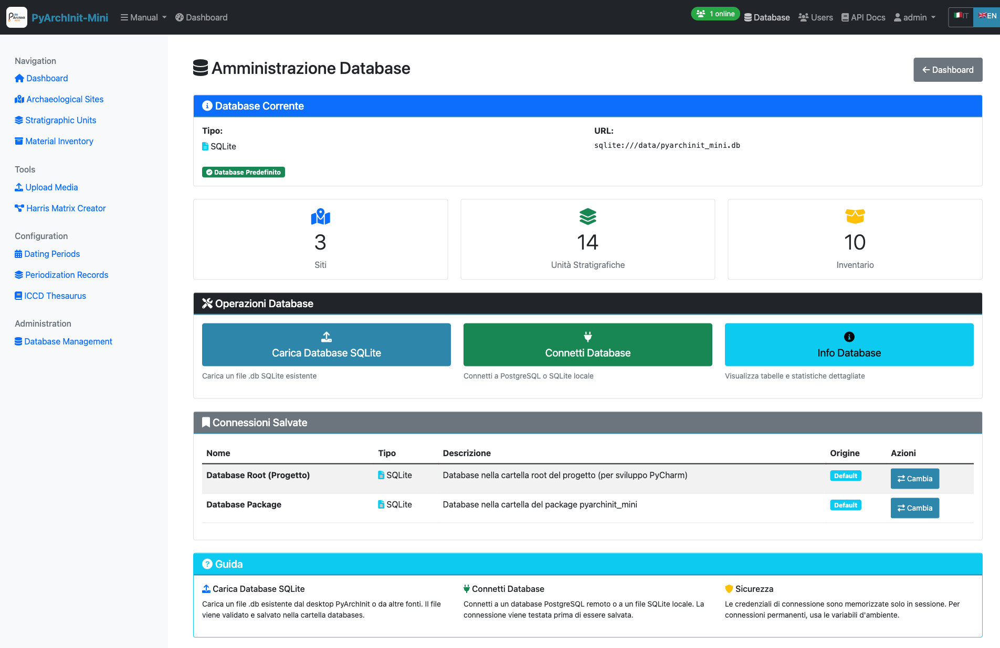

**Database Operations:**
- View database information
- Database backup
- Database restore
- Optimize database
- Vacuum (SQLite)

**Upload Database:**
- Upload new SQLite database
- Replace current database
- Import from file
- Validation before replacement

**Connect to Database:**
- Configure PostgreSQL connection
- Test connection
- Switch databases
- Connection string builder

**Database Statistics:**
- Database size
- Table counts
- Record counts per table
- Index information
- Performance metrics

### User Management

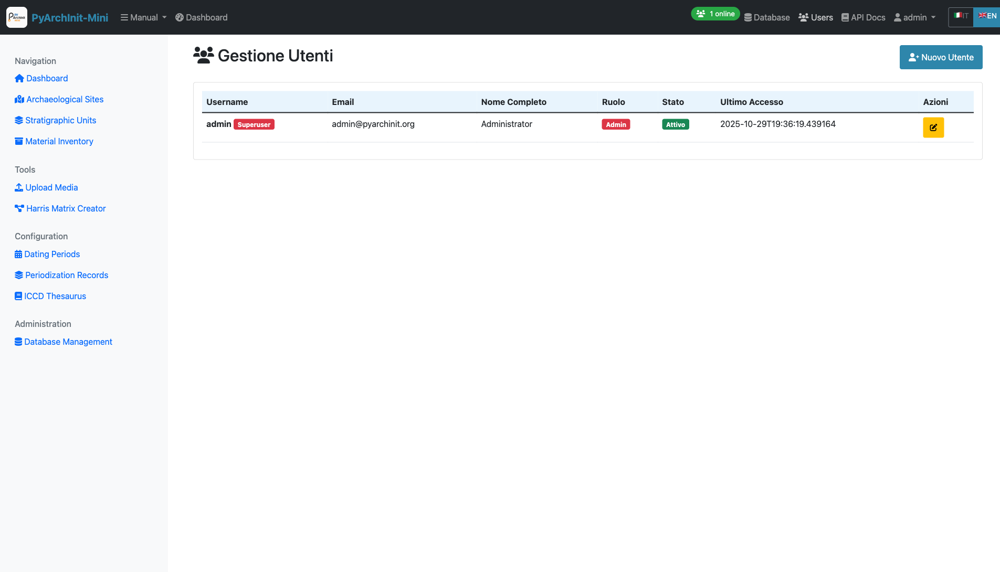

**User Administration:**
- View all users
- Create new users
- Edit user details
- Delete users (with confirmation)
- Reset passwords

**User Fields:**
- Username
- Full Name
- Email
- Role (Admin, Operator, Viewer)
- Active status
- Last login date

**Permissions:**
- Create (Sites, US, Inventario)
- Read (View data)
- Update (Edit records)
- Delete (Remove records)
- Manage Users (Admin only)

**Security:**
- Password strength requirements
- Account lockout after failed attempts
- Session timeout configuration
- Audit log of user actions

---

## Best Practices

### Data Entry

1. **Start with Sites**: Create site records before US or inventory
2. **Use Consistent Naming**: Follow naming conventions for areas and US numbers
3. **Document Relationships**: Always define stratigraphic relationships in Tab 3
4. **Add Chronology**: Include dating information for better analysis
5. **Attach Media**: Link photos and documents as you work

### Workflow

1. **Plan Your Structure**: Define sites and areas first
2. **Enter Stratigraphic Data**: Record US with relationships as you excavate
3. **Validate Regularly**: Run validation checks to catch issues early
4. **Generate Matrix**: Create Harris Matrix to visualize sequences
5. **Inventory Finds**: Record materials linked to their US
6. **Export Data**: Regular backups and exports for safety

### Performance

1. **Filter Lists**: Use filters to reduce load times on large datasets
2. **Paginate Results**: Keep page size at 20-50 records
3. **Optimize Database**: Run database optimization periodically
4. **Clear Browser Cache**: If experiencing slowness
5. **Use Chrome/Firefox**: For best performance and compatibility

### Collaboration

1. **Define Roles**: Assign appropriate roles to team members
2. **Use Consistent Terminology**: Agree on thesaurus terms
3. **Document Changes**: Add notes when editing others' records
4. **Regular Syncs**: Export and share data frequently
5. **Communication**: Use validation reports to discuss data quality

---

## Keyboard Shortcuts

- `Ctrl/Cmd + S`: Save current form
- `Ctrl/Cmd + K`: Quick search
- `Alt + N`: Create new record
- `Alt + B`: Back to list
- `Alt + P`: Previous record
- `Alt + N`: Next record
- `Esc`: Cancel current action

---

## Troubleshooting

### Common Issues

**1. Cannot Login**
- Check credentials (default: admin/admin)
- Clear browser cookies and cache
- Check server is running on port 5001
- Verify database connection

**2. Slow Performance**
- Reduce page size in lists
- Filter data before viewing
- Check database size (optimize if large)
- Close unused browser tabs

**3. Import Errors**
- Verify Excel format matches template
- Check for duplicate records
- Validate data types (numbers, dates)
- Review error log in import results

**4. Harris Matrix Not Generating**
- Ensure US have stratigraphic relationships defined
- Check for cycles using validation tool
- Verify at least 2 US exist for the site
- Check US numbers are consistent

**5. Missing Data After Refresh**
- Forms may not auto-save (save manually)
- Check if you're logged in (session timeout)
- Verify database connection
- Check browser console for errors

### Getting Help

- **Documentation**: https://pyarchinit-mini.readthedocs.io/
- **GitHub Issues**: https://github.com/enzococca/pyarchinit-mini/issues
- **Email Support**: enzo.ccc@gmail.com

---

## Conclusion

PyArchInit-Mini Web GUI provides a complete, modern interface for archaeological data management. This tutorial covers all major features - explore the system to discover additional capabilities and shortcuts.

**Key Takeaways:**
- Web interface offers 100% desktop GUI functionality
- Multi-tab forms organize complex archaeological data
- Harris Matrix auto-generation from relationships
- Comprehensive analytics and validation tools
- Multi-user support with role-based access
- Multiple import/export formats for flexibility

**Next Steps:**
1. Practice creating sites and US
2. Experiment with stratigraphic relationships
3. Generate your first Harris Matrix
4. Explore analytics for insights
5. Configure Extended Matrix for your workflow

---

**Version**: 1.7.13
**Tutorial Last Updated**: 2025-10-29
**Screenshots**: 63 images captured from live system
