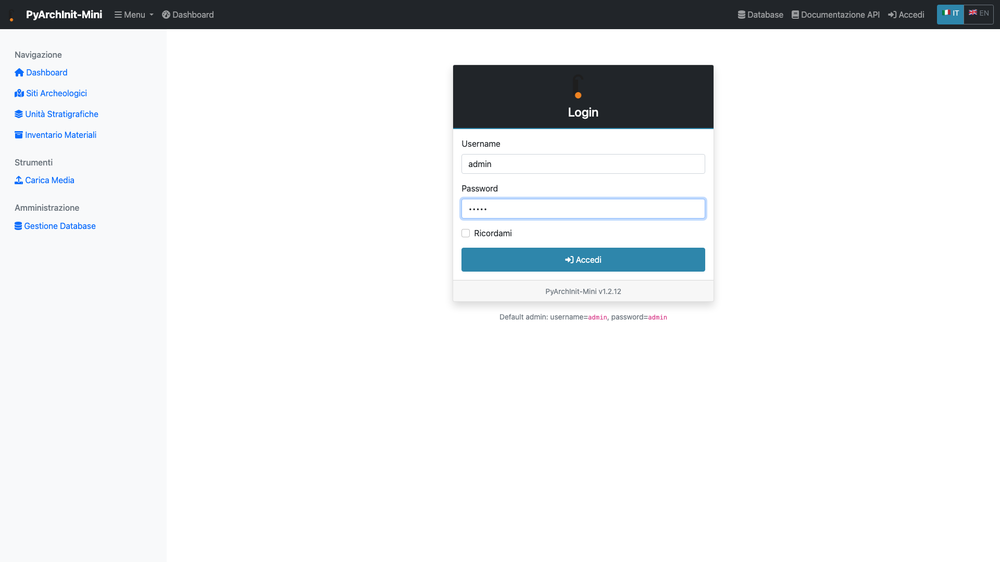
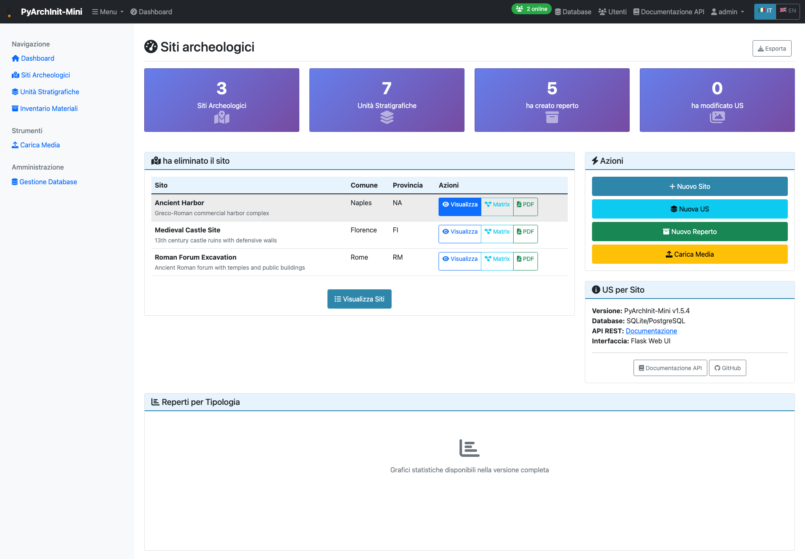
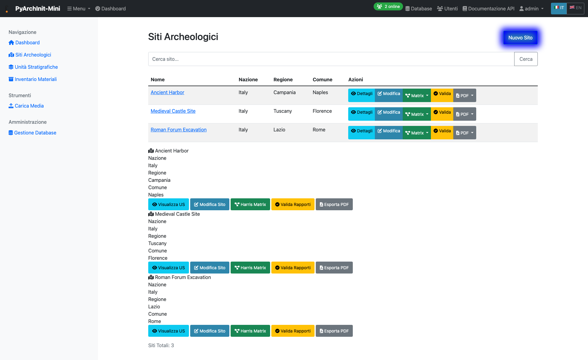

Web Interface Tutorial
======================

This tutorial guides you through using PyArchInit-Mini's web interface to manage archaeological data.

Prerequisites
-------------

* PyArchInit-Mini installed (``pip install pyarchinit-mini``)
* Python 3.9 or higher
* Web browser (Chrome, Firefox, Safari, or Edge)

Starting the Web Interface
---------------------------

Launch the web interface using the command line:

.. code-block:: bash

   pyarchinit-mini-web

The server will start on http://localhost:5001 by default.

You should see output similar to:

.. code-block:: text

   Starting PyArchInit-Mini Web Interface on 0.0.0.0:5001
   Web Interface: http://localhost:5001/
   WebSocket support enabled for real-time collaboration

Step 1: Login
-------------

Open your web browser and navigate to http://localhost:5001

You'll see the login page:

   **Login Page** - Enter your credentials to access the system

Default credentials for the tutorial database:

* **Username**: admin
* **Password**: admin

.. note::
   In production environments, always change the default credentials and use strong passwords.

Enter your credentials and click the **Login** button.

Step 2: Dashboard Overview
---------------------------

After successful login, you'll see the main dashboard:

   **Dashboard** - Main interface showing quick access to all modules

The dashboard provides:

* **Quick Statistics**: Overview of sites, stratigraphic units, and finds
* **Recent Activity**: Latest modifications and additions
* **Navigation Menu**: Access to all data management modules
* **User Profile**: Account settings and logout option

Dashboard Components
~~~~~~~~~~~~~~~~~~~~

1. **Top Navigation Bar**

   * Home icon: Return to dashboard
   * Module links: Sites, US, Inventory, Documentation, Matrix
   * Search bar: Quick search across all data
   * User menu: Profile, settings, logout

2. **Statistics Cards**

   * Total Sites
   * Stratigraphic Units
   * Inventory Items
   * Active Excavations

3. **Quick Actions**

   * Create New Site
   * Add Stratigraphic Unit
   * Record Find
   * Generate Reports

Step 3: Managing Sites
----------------------

Click on **Sites** in the navigation menu to view all archaeological sites:

   **Sites List** - View and manage all archaeological sites

The sites list shows:

* Site name and location
* Definition and description
* Number of associated stratigraphic units
* Quick action buttons (View, Edit, Delete)

Creating a New Site
~~~~~~~~~~~~~~~~~~~

1. Click the **Create New Site** button (highlighted in blue)
2. Fill in the site information:

   * **Site Name** (required): Unique identifier for the site
   * **Location**: Nation, region, municipality, province
   * **Definition**: Brief description of the site type
   * **Description**: Detailed information about the site

3. Click **Save** to create the site

.. tip::
   Use clear, descriptive names for sites to make them easy to find and identify later.

Viewing Site Details
~~~~~~~~~~~~~~~~~~~~

Click on a site name to view its complete details:

* **General Information**: Location, definition, description
* **Stratigraphic Units**: List of US associated with this site
* **Finds**: Inventory items discovered at the site
* **Documentation**: Attached files, photos, and reports
* **Harris Matrix**: Stratigraphic relationships visualization

Working with Stratigraphic Units
---------------------------------

From the **US** (Unità Stratigrafiche) module, you can:

1. **Create New US**

   * Site selection
   * Area and US number
   * Stratigraphic and interpretative description
   * Physical characteristics (color, consistency, formation)
   * Dating and period information

2. **Define Relationships**

   * Covers / Covered by
   * Cuts / Cut by
   * Fills / Filled by
   * Equals / Equal to

3. **View Harris Matrix**

   * Automatic generation based on relationships
   * Interactive visualization
   * Export as PDF or image

Managing Inventory
------------------

The **Inventory** module handles archaeological finds:

1. **Recording Finds**

   * Inventory number
   * Find type and classification
   * Description and definition
   * Provenance (site, area, US)
   * Conservation status
   * Dating

2. **Attaching Media**

   * Upload photos
   * Add drawings and sketches
   * Attach technical documentation

3. **Export Data**

   * Excel format
   * CSV for analysis
   * PDF reports

Advanced Features
-----------------

Multilingual Support
~~~~~~~~~~~~~~~~~~~~

PyArchInit-Mini supports Italian and English:

* Toggle language from the user menu
* All interface elements translate automatically
* Data entry supports bilingual fields for descriptions

Search and Filters
~~~~~~~~~~~~~~~~~~

Use the advanced search features:

* **Quick Search**: Type in the top navigation bar
* **Advanced Filters**: Filter by date, location, type, status
* **Saved Searches**: Save frequently used filter combinations

Collaboration
~~~~~~~~~~~~~

Real-time collaboration features:

* **WebSocket Updates**: See changes from other users instantly
* **User Activity**: Track who is editing what
* **Conflict Resolution**: Automatic handling of concurrent edits

Exporting Data
--------------

Generate reports and export data:

1. **Site Reports**

   * Complete site documentation
   * Harris Matrix included
   * Inventory summary
   * Export as PDF

2. **Data Export**

   * CSV for spreadsheet analysis
   * JSON for data interchange
   * SQL dump for backup

3. **Harris Matrix**

   * SVG vector format
   * PNG raster image
   * GraphML for analysis tools

Best Practices
--------------

Data Entry Guidelines
~~~~~~~~~~~~~~~~~~~~~

1. **Use Consistent Terminology**

   * Establish a project vocabulary
   * Use the thesaurus feature for standardization
   * Document conventions in the site description

2. **Regular Backups**

   * Export data periodically
   * Use the database backup feature
   * Store backups in multiple locations

3. **Detailed Descriptions**

   * Write clear, complete descriptions
   * Include interpretations and observations
   * Reference bibliography when applicable

4. **Accurate Relationships**

   * Define stratigraphic relationships carefully
   * Review the Harris Matrix regularly
   * Correct errors promptly

Troubleshooting
---------------

Common Issues
~~~~~~~~~~~~~

**Login Problems**

* Verify username and password
* Check that the database is accessible
* Ensure the web server is running

**Slow Performance**

* Check database size and optimization
* Clear browser cache
* Use filters to limit displayed data

**Data Not Saving**

* Check for validation errors
* Ensure required fields are filled
* Verify database permissions

Getting Help
~~~~~~~~~~~~

* **Documentation**: https://docs.pyarchinit.org
* **GitHub Issues**: https://github.com/pyarchinit/pyarchinit-mini/issues
* **Community Forum**: https://forum.pyarchinit.org

Next Steps
----------

* Explore the **Desktop GUI Tutorial** for offline data entry
* Learn about **Harris Matrix** visualization
* Read the **API Documentation** for custom integrations

.. seealso::

   * :doc:`installation_tutorial`
   * :doc:`desktop_gui_tutorial`
   * :doc:`../user/web_interface`
   * :doc:`../developer/api`
