Web Interface Complete Tutorial
=================================

.. versionadded:: 1.7.13
   Complete visual tutorial with 63 screenshots covering all Web GUI features

This tutorial provides a complete visual walkthrough of the PyArchInit-Mini Web interface, covering all features, forms, and functions with real screenshots.

.. contents:: Table of Contents
   :local:
   :depth: 2

Prerequisites
-------------

* PyArchInit-Mini v1.7.13+ installed (``pip install pyarchinit-mini``)
* Python 3.8 or higher
* Modern web browser (Chrome, Firefox, Safari, Edge)
* SQLite or PostgreSQL database

Starting the Web Server
------------------------

Launch the web interface from command line:

.. code-block:: bash

   # Start with default database
   pyarchinit-mini-web

   # Start with specific database
   DATABASE_URL="sqlite:///data/pyarchinit_mini.db" python3 -m pyarchinit_mini.web_interface.app

   # Start on custom port
   PYARCHINIT_WEB_PORT=8080 pyarchinit-mini-web

The web interface will be available at: **http://localhost:5001**

.. note::
   Port 5001 is used by default to avoid conflicts with AirPlay on macOS (which uses port 5000).

Getting Started
===============

Authentication
--------------

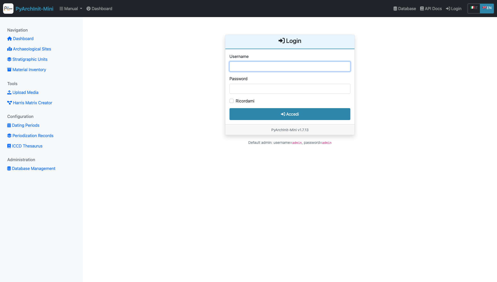

   **Login Page** - Entry point to PyArchInit-Mini Web GUI

The login page is the entry point to the system.

**Default Credentials:**

* Username: ``admin``
* Password: ``admin``

.. warning::
   In production environments, always change the default credentials immediately after first login.

**Login Process:**

1. **Enter Username**

.. figure:: ../_static/images/webapp/002_highlight_Username_Field.png
   :alt: Username Field
   :align: center
   :width: 70%

   Username field highlighted

2. **Enter Password**

.. figure:: ../_static/images/webapp/002_highlight_Username_Field.png
   :alt: Password Field
   :align: center
   :width: 70%

   Password field highlighted

3. **Click Login Button**

   Login button highlighted

Security Features
~~~~~~~~~~~~~~~~~

* Session-based authentication
* Role-based access control (Admin, Operator, Viewer)
* Secure password hashing with bcrypt
* Auto-logout on browser close

Dashboard
=========

.. figure:: ../_static/images/webapp/004_dashboard_main.png
   :alt: Main Dashboard
   :align: center
   :width: 100%

   **Main Dashboard** - Overview of system statistics and quick navigation

After logging in, the dashboard provides:

**Statistics Cards:**

* Total Sites count
* Total Stratigraphic Units (US)
* Total Inventory Items
* Database information
* System version (v1.7.13)

**Recent Activity:**

* Latest created sites
* Recent stratigraphic units
* Recent inventory additions

**Quick Navigation:**

* Access all major modules from top navigation menu
* Responsive design adapts to screen size
* Real-time statistics updates

Site Management
===============

Sites are the top-level organizational units representing archaeological sites or excavation areas.

Site List
---------

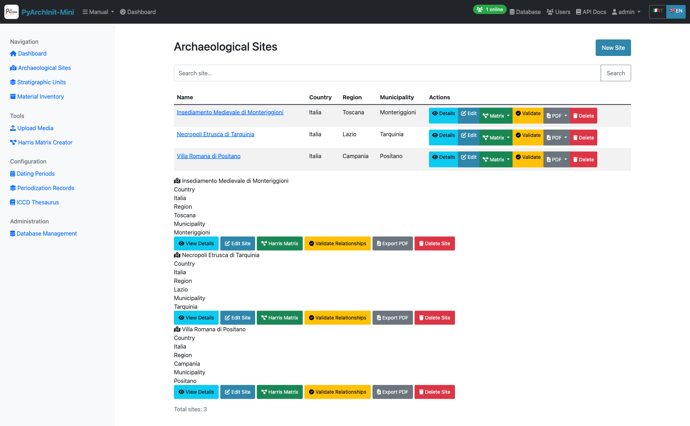

   **Sites List** - Paginated list of all archaeological sites

Features:

* Paginated list (20 sites per page)
* Search by site name
* Quick view of location (Nation, Region, Province, Municipality)
* Direct links to site details
* Create new site button

Site Detail View
----------------

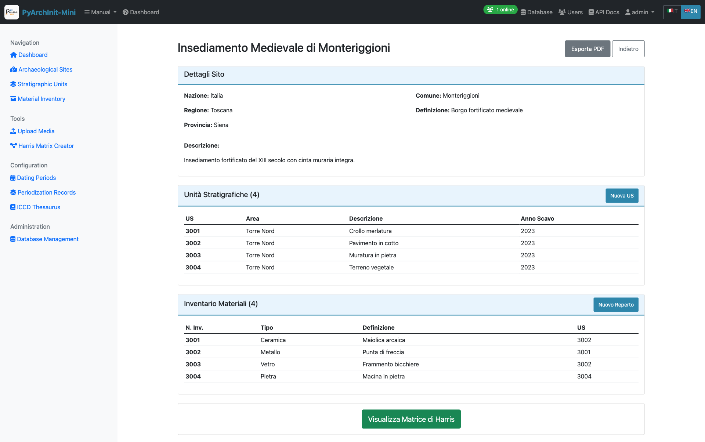

   **Site Detail** - Complete site information with related data

The site detail page shows:

* Complete site information
* Associated stratigraphic units
* Related inventory items
* Geographic location details
* Edit and delete options

Creating a New Site
-------------------

.. figure:: ../_static/images/webapp/008_sites_form.png
   :alt: New Site Form
   :align: center
   :width: 100%

   **Site Form** - Create or edit site information

**Required Fields:**

* Site Name (Nome Sito)

**Optional Fields:**

* Nation (Nazione)
* Region (Regione)
* Province (Provincia)
* Municipality (Comune)
* Site Definition (Definizione Sito)
* Description (Descrizione)
* English translations for definition and description

**Form Features:**

* Client-side validation
* i18n support (Italian/English)
* Auto-save draft functionality
* Cancel to return to list

Stratigraphic Units (US)
=========================

The US (Unità Stratigrafiche) module manages stratigraphic units with comprehensive archaeological data organized across **6 tabs**.

US List
-------

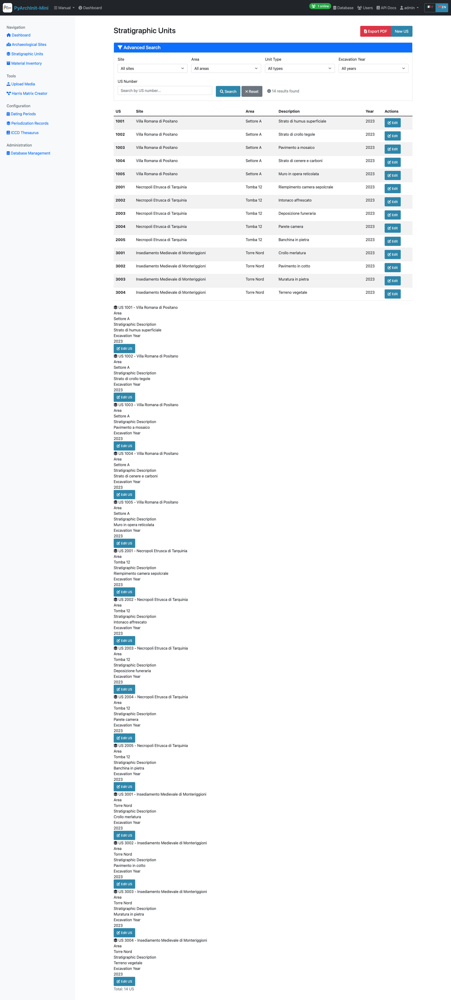

   **US List** - Stratigraphic units with advanced filtering

Features:

* Paginated list with advanced filtering
* Filter by site, area, unit type, year
* Quick view of US number, site, and area
* Color-coded by unit type
* Bulk operations support

Creating a New US
-----------------

The US form is organized into **6 comprehensive tabs** for better data organization.

Tab 1: Basic Information
~~~~~~~~~~~~~~~~~~~~~~~~~

   **Tab 1: Basic Information** - Site selection and primary identification fields

**Required Fields:**

* Site (Sito) - Select from dropdown
* US Number (Numero US) - Unique stratigraphic unit identifier within the site

**Optional Fields:**

* Area (Area) - Excavation area or sector
* Year (Anno) - Excavation year
* Archaeologist (Archeologo) - Person responsible for excavation

.. tip::
   The combination of Site + US Number must be unique in the system.

Tab 2: Descriptions
~~~~~~~~~~~~~~~~~~~~

.. figure:: ../_static/images/webapp/016_us_form_tab2_descriptions.png
   :alt: US Form Tab 2 - Descriptions
   :align: center
   :width: 100%

   **Tab 2: Descriptions** - Stratigraphic and interpretative descriptions

**Fields:**

* **Stratigraphic Description** (Descrizione Stratigrafica) - Objective physical description
* **Interpretative Description** (Descrizione Interpretativa) - Archaeological interpretation
* **Detailed Description** (Descrizione Estesa) - Extended description with additional details
* **Interpretation** (Interpretazione) - Functional/chronological interpretation
* **Observations** (Osservazioni) - Additional observations and notes

.. tip::
   **Tip**: Specifying the initial and final period helps to chronologically contextualize the stratigraphic unit in the archaeological site.

Tab 3: Physical Characteristics
~~~~~~~~~~~~~~~~~~~~~~~~~~~~~~~~~

   **Tab 3: Physical Characteristics** - Material properties and composition

**Fields:**

* Unit Type (Tipo US) - e.g., Layer (Strato), Cut (Taglio), Fill (Riempimento)
* Formation Type (Tipo Formazione) - Natural (Naturale) / Artificial (Artificiale)
* Color (Colore) - Munsell or descriptive color
* Consistency (Consistenza) - Soil consistency description
* Texture (Tessitura) - Grain size and texture
* Compaction (Compattezza) - Degree of compaction
* Inclusions (Inclusioni) - Materials present in the matrix
* Soil composition details

Tab 4: Chronology
~~~~~~~~~~~~~~~~~~

.. figure:: ../_static/images/webapp/020_us_form_tab4_chronology.png
   :alt: US Form Tab 4 - Chronology
   :align: center
   :width: 100%

   **Tab 4: Chronology** - Dating and periodization

**Periodization Section:**

* **Initial Period** (Periodo Iniziale) - Starting chronological period (select from dating periods table)
* **Final Period** (Periodo Finale) - Ending chronological period
* **Dating** (Datazione) - Dating method and results dropdown
* **Reliability** (Affidabilità) - Dating reliability assessment

.. tip::
   Use the standardized dating periods from the Datazione table for consistency across the project.

Tab 5: Stratigraphic Relationships
~~~~~~~~~~~~~~~~~~~~~~~~~~~~~~~~~~~~

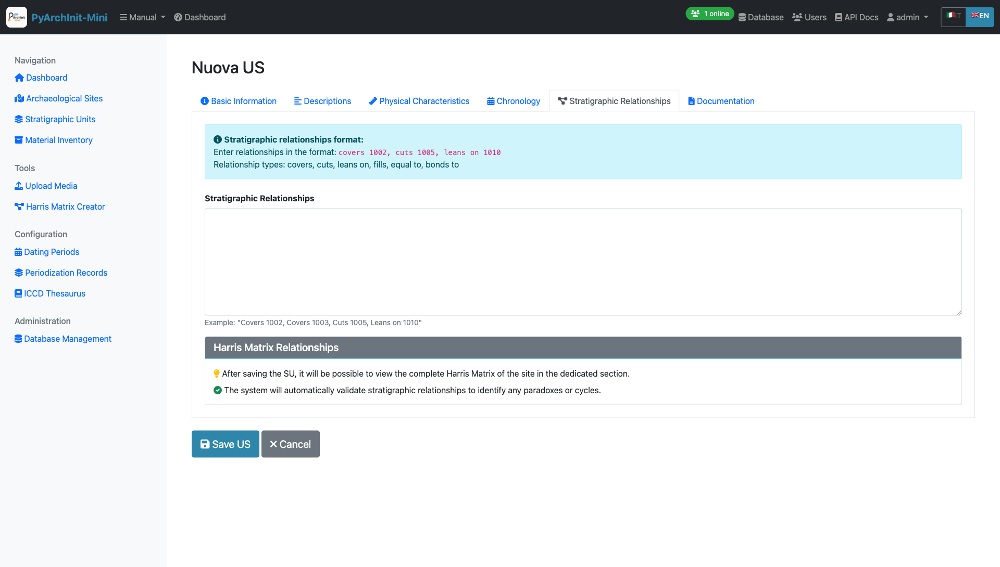

   **Tab 5: Stratigraphic Relationships** - Define stratigraphic connections for Harris Matrix

**Relationship Types:**

* **Covers** (Copre) - This US covers/overlies another US
* **Covered by** (Coperto da) - This US is covered by another US
* **Cuts** (Taglia) - This US cuts through another US
* **Cut by** (Tagliato da) - This US is cut by another US
* **Fills** (Riempie) - This US fills a cut
* **Filled by** (Riempito da) - This US (a cut) is filled by another US
* **Equals** (Uguale a) - This US is the same as another US
* **Adjacent to** (Si appoggia a) - This US is adjacent to another US

**Text Format Example:**

.. code-block:: text

   copre 1002, 1003
   taglia 1005
   si appoggia a 1010, 1011

These relationships are automatically used to generate the Harris Matrix.

.. tip::
   Use consistent relationship definitions to ensure accurate Harris Matrix generation. Each relationship should be reciprocal (if US 1001 covers 1002, then 1002 is covered by 1001).

Tab 6: Documentation
~~~~~~~~~~~~~~~~~~~~~

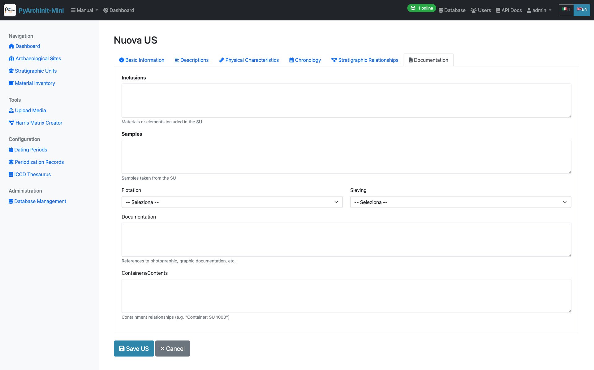

   **Tab 6: Documentation** - Media attachments and references

**Features:**

* Photo uploads and gallery
* Drawing attachments
* 3D model links
* Document references
* Bibliography
* Media metadata management

.. note::
   Media files are stored in the uploads directory and linked to the US record. Supported formats: JPG, PNG, PDF, DXF, OBJ.

Advanced US Features
--------------------

**Navigation:**

* Previous/Next buttons to navigate between records
* Position counter (e.g., "Record 5 of 20")
* Respects active filters

**Data Validation:**

* Required field checking
* US number uniqueness validation
* Relationship syntax validation
* Date format validation

Material Inventory
==================

The Inventario module manages archaeological finds and materials with **8 specialized tabs** following ICCD (Istituto Centrale per il Catalogo e la Documentazione) standards.

Inventory List
--------------

.. figure:: ../_static/images/webapp/026_inventario_list.png
   :alt: Inventory List
   :align: center
   :width: 100%

   **Inventory List** - Material finds with filtering

Features:

* Paginated list with filters
* Filter by site, area, US, artifact type
* Material type icons
* Conservation state indicators
* Quick search by inventory number
* Direct links to artifact details

Creating a New Inventory Item
------------------------------

The inventory form spans **8 comprehensive tabs** organized to capture complete artifact documentation.

Tab 1: Identification
~~~~~~~~~~~~~~~~~~~~~~

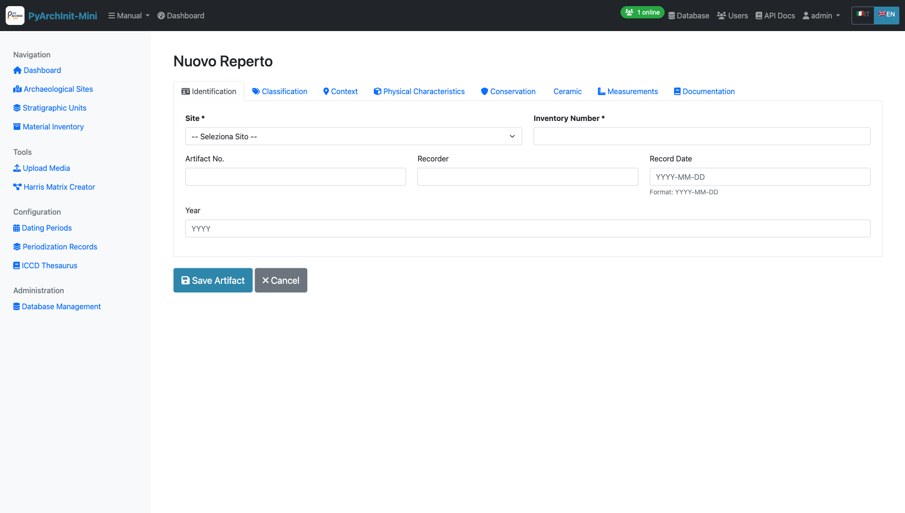

   **Tab 1: Identification** - Basic artifact identification and recording information

**Required Fields:**

* Site (Sito) - Select from dropdown
* Inventory Number (Numero Inventario) - Unique identifier

**Optional Fields:**

* Artifact Number (N. Reperto)
* Recorder (Schedatore) - Person who catalogued the artifact
* Record Date (Date Scheda) - Date of cataloging (Format: YYYY-MM-DD)
* Year (Years) - Excavation or discovery year

.. tip::
   The combination of Site + Inventory Number must be unique in the system.

Tab 2: Classification
~~~~~~~~~~~~~~~~~~~~~~

.. figure:: ../_static/images/webapp/030_inventario_form_tab2_classification.png
   :alt: Inventory Form Tab 2 - Classification
   :align: center
   :width: 100%

   **Tab 2: Classification** - Typological classification and description

**Fields:**

* **Artifact Type** (Tipo Reperto) - Controlled vocabulary from thesaurus (e.g., Ceramic, Metal, Stone, Bone, Glass)
* Recording Criteria (Criterio Schedatura) - Documentation method used
* Definition (Definizione) - Specific object definition
* Type (Tipo) - Typological classification
* Container Type (Tipo Contenitore) - For vessel artifacts
* Structure (Struttura) - Structural characteristics
* **Description** (Descrizione) - Detailed artifact description (long text field)

.. note::
   Artifact Type uses controlled vocabulary from the ICCD Thesaurus for consistency.

Tab 3: Context
~~~~~~~~~~~~~~

.. figure:: ../_static/images/webapp/032_inventario_form_tab3_context.png
   :alt: Inventory Form Tab 3 - Archaeological Context
   :align: center
   :width: 100%

   **Tab 3: Context** - Archaeological context and stratigraphic provenance

**Fields:**

* Area (Area) - Excavation area where artifact was found
* SU (US) - Associated Stratigraphic Unit number
* Find Spot (Punto Rinv) - Precise location within the SU
* Artifact Elements (Elementi Reperto) - Description of constituent elements

.. tip::
   **Archaeological Context Information**: This tab links the artifact to its stratigraphic origin, essential for understanding depositional context and dating.

Tab 4: Physical Characteristics
~~~~~~~~~~~~~~~~~~~~~~~~~~~~~~~~~

   **Tab 4: Physical Characteristics** - Material properties and storage

**Fields:**

* **Conservation State** (Stato Conservazione) - Controlled vocabulary from thesaurus
* Washed (Lavato) - Yes/No dropdown
* Box Number (Nr. Cassa) - Storage box identifier
* Storage Location (Luogo Conservazione) - Current storage facility/room

.. note::
   Conservation State uses standardized terms from the ICCD Thesaurus.

Tab 5: Conservation & Management
~~~~~~~~~~~~~~~~~~~~~~~~~~~~~~~~~~

.. figure:: ../_static/images/webapp/036_inventario_form_tab5_conservation.png
   :alt: Inventory Form Tab 5 - Conservation Management
   :align: center
   :width: 100%

   **Tab 5: Conservation** - Cataloging status and diagnostic significance

**Fields:**

* Catalogued (Repertato) - Yes/No - Has the artifact been photographically documented?
* Diagnostic (Diagnostico) - Yes/No - Is the artifact significant for dating the layer?

**Tips Box:**

* **Catalogued**: Indicates if the artifact has been photographically documented
* **Diagnostic**: Indicates if the artifact is significant for dating the layer

.. important::
   Diagnostic artifacts are particularly important for chronological interpretation of the stratigraphic sequence.

Tab 6: Ceramic Characteristics
~~~~~~~~~~~~~~~~~~~~~~~~~~~~~~~~

   **Tab 6: Ceramic** - Specialized fields for ceramic artifacts

**Fields:**

* **Ceramic Body** (Corpo Ceramico) - Controlled vocabulary from thesaurus (fabric type)
* **Coating** (Rivestimento) - Controlled vocabulary from thesaurus (surface treatment)
* Rim Diameter (Diametro Orlo) - In centimeters (e.g., 12.5)
* Rim EVE (Eve Orlo) - Estimated Vessel Equivalent (preserved fraction 0-1, e.g., 0.25)

.. note::
   **This tab is specific for ceramic artifacts**. EVE (Estimated Vessel Equivalent) indicates the preserved fraction of the rim circumference.

Tab 7: Measurements
~~~~~~~~~~~~~~~~~~~~

.. figure:: ../_static/images/webapp/040_inventario_form_tab7_measurements.png
   :alt: Inventory Form Tab 7 - Quantitative Measurements
   :align: center
   :width: 100%

   **Tab 7: Measurements** - Weight and quantitative data

**Weight and Quantitative Measurements (Card Section):**

* Weight (Peso) - In grams (e.g., 125.5)
* Total Fragments (Totale Frammenti) - Number of fragments (e.g., 5)
* Minimum Forms (Forme Minime) - Minimum number of individuals (e.g., 1)
* Maximum Forms (Forme Massime) - Maximum number of individuals (e.g., 3)

**Additional Field:**

* Detailed Measurements (Misurazioni) - Free text for other measurements: length, width, height, thickness, etc.

.. tip::
   Minimum and Maximum Forms help estimate the number of individual vessels represented by the fragments.

Tab 8: Documentation
~~~~~~~~~~~~~~~~~~~~~

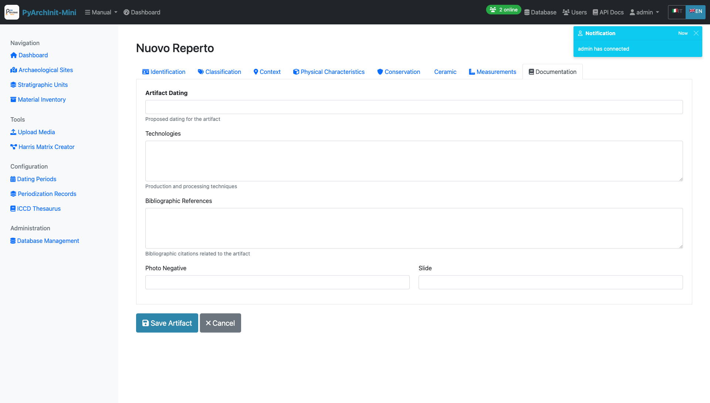

   **Tab 8: Documentation** - Dating, technology, and bibliographic references

**Fields:**

* **Artifact Dating** (Datazione Reperto) - Proposed chronological attribution
* Technologies (Tecnologie) - Production and processing techniques (long text)
* Bibliographic References (Rif. Biblio) - Citations related to the artifact (long text)
* Photo Negative (Negativo Photo) - Negative reference number
* Slide (Diapositiva) - Slide reference number

.. note::
   Use this tab to document technical analysis, parallels, and scholarly references that support artifact interpretation.

Upload Media
============

The Media Upload tool allows you to attach photos, drawings, and documents to archaeological records.

.. figure:: ../_static/images/webapp/044_media_upload_page.png
   :alt: Upload Media Interface
   :align: center
   :width: 100%

   **Upload Media** - File upload for Sites, US, and Inventory items

**Upload Interface:**

* Entity Type selection (Site, US, Inventory)
* Entity ID association
* File upload with drag-and-drop support
* Description and metadata fields
* Author/Photographer attribution

**Supported File Types:**

* Images: JPG, PNG, TIFF, RAW
* Documents: PDF, DOC, DOCX
* Drawings: DWG, DXF, SVG
* 3D Models: OBJ, PLY, STL

**Features:**

* Multiple file upload
* Automatic thumbnail generation
* Image EXIF data extraction
* File size validation
* Organized by entity and type

.. tip::
   Photos and drawings can be linked to specific stratigraphic units or inventory items for complete documentation.

Harris Matrix Creator
=====================

Interactive visual editor for creating and editing Harris Matrix diagrams.

   **Harris Matrix Creator** - Interactive graphical editor with Extended Matrix support

**Visual Editor Features:**

* Drag-and-drop node creation
* Interactive relationship connections
* Real-time visual preview
* Zoom and pan navigation
* Auto-layout algorithms

**Extended Matrix Support:**

* 14 different node types (US, USM, USVA, DOC, Extractor, etc.)
* 14 relationship types (Covers, Cuts, Continuity, etc.)
* Period and area grouping
* Custom node descriptions
* Color-coded node types

**Database Integration:**

* Save directly to database
* Edit existing matrices
* Automatic validation
* Relationship consistency checks

**Export Options:**

* Export to GraphML (yEd compatible)
* Export to DOT (Graphviz)
* High-resolution PDF rendering
* Share with colleagues

**Alternative: CSV/Excel Import:**

For users who prefer working with spreadsheets, Harris Matrices can also be created by importing CSV or Excel files using the command-line tool.

Harris Matrix Visualization
============================

View and analyze the generated Harris Matrix diagrams with interactive tools.

   **Harris Matrix View** - Interactive stratigraphic diagram with depth levels

**Visualization Features:**

* Hierarchical stratigraphic sequence display
* Maximum depth level calculation
* Node relationships visualization
* Graphviz rendering engine
* Zoom and navigation controls

**Matrix Information:**

* Total stratigraphic units count
* Relationship connections display
* Stratigraphic sequence by levels
* Period and area grouping

GraphML Export
==============

Export Harris Matrix diagrams in GraphML format for advanced editing with yEd Graph Editor.

   **GraphML Export** - Advanced export options with Extended Matrix support

**Export Parameters:**

* Archaeological Site selection
* Diagram title customization
* Grouping options (Period + Area)
* Period order (Normal/Reverse)

**Export Formats:**

* **GraphML**: yEd Graph Editor compatible format with complete metadata
* **s3Dgraphy (Extended Matrix)**: Export in Heriverse/ATON format with 3D model support
* **Interactive Viewer**: Web-based interactive stratigraphic viewer

**s3Dgraphy Features:**

* Complete metadata for each SU
* 3D model support (GLB/GLTF)
* Extended Matrix Framework compliant
* Heriverse/ATON wrapper with CocoDrill semantic shapes
* Interactive 3D stratigraphy viewer

.. tip::
   Download yEd Graph Editor from https://www.yworks.com/products/yed for advanced diagram editing and automatic layout algorithms.

Excel/CSV Import
================

Import archaeological data from Excel or CSV files for bulk data entry.

   **Excel Import** - Bulk data import from spreadsheets

**Supported Data Types:**

* Stratigraphic Units (US)
* Material Inventory
* Site information
* Dating periods

**Import Process:**

1. Download template file for the data type
2. Fill in the spreadsheet with your data
3. Upload the completed file
4. Review validation report
5. Confirm import

.. note::
   Excel import validates data before insertion to ensure database integrity.

Data Import/Export
==================

PyArchInit-compatible import and export for data migration and backup.

   **PyArchInit Import/Export** - Data migration and backup tools

Import from PyArchInit Database
--------------------------------

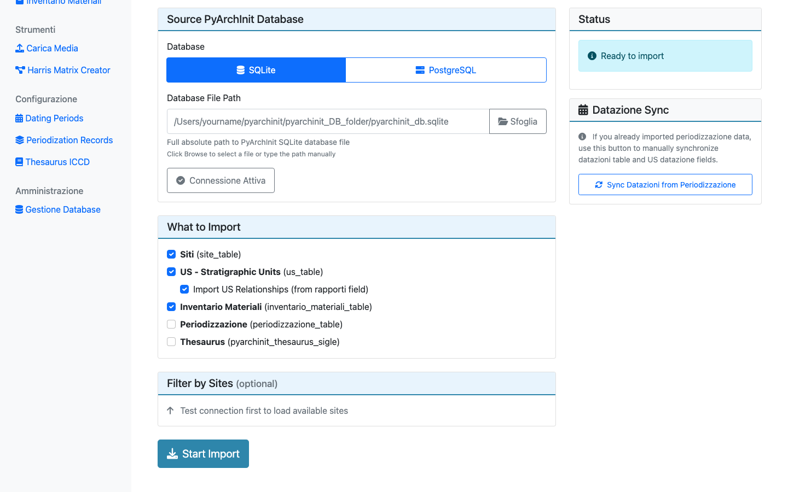

   **Import Interface** - Migrate data from existing PyArchInit databases

**Import Options:**

* Full database import
* Selective table import
* Data mapping and transformation
* Validation and error reporting

Export to PyArchInit Format
----------------------------

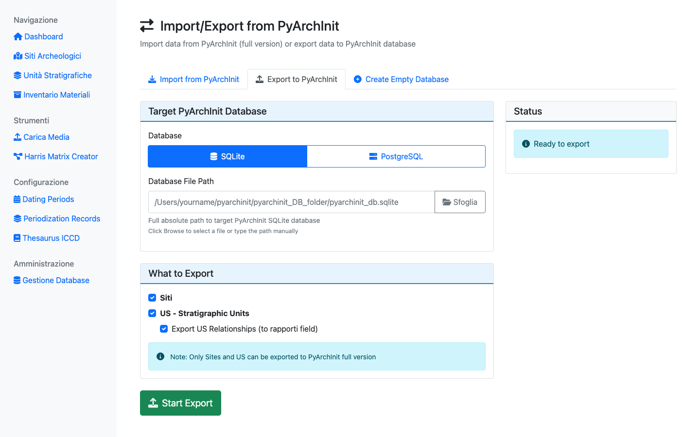

   **Export Interface** - Export data in PyArchInit-compatible format

**Export Formats:**

* SQLite database export
* CSV export by table
* Complete project backup
* Selective data export

Create New Database
-------------------

   **Database Creation** - Initialize new PyArchInit-Mini database

**Database Setup:**

* Database name and location
* Schema initialization
* Default data population
* User account creation

Extended Matrix Node Configuration
===================================

Configure node types for Extended Matrix Framework diagrams.

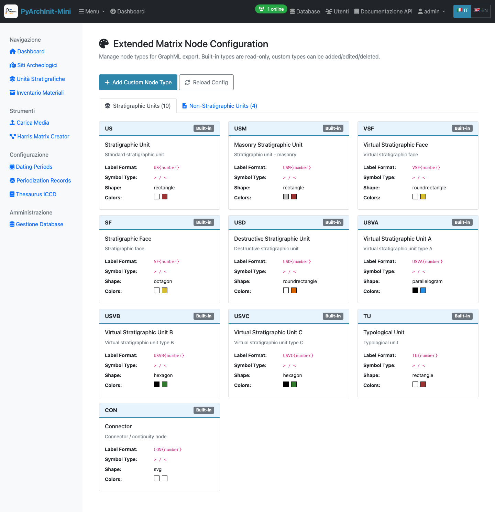

   **Extended Matrix Node Configuration** - Manage node types and relationships

**Node Type Management:**

* 14 standard node types (US, USM, USVA, DOC, etc.)
* Custom node type creation
* Color and style configuration
* Icon assignment
* Display preferences

**Relationship Configuration:**

* 14 relationship types
* Bidirectional relationship mapping
* Validation rules
* Visual representation settings

Dating Periods Management
=========================

Manage standardized chronological periods for consistent dating across the project.

   **Dating Periods** - Chronological period definitions

Create New Dating Period
-------------------------

   **Dating Period Form** - Define chronological periods with date ranges

**Period Fields:**

* Period name (e.g., "Bronze Age", "Roman Imperial")
* Start date (numeric or BCE/CE)
* End date
* Description and notes
* Parent period (for hierarchical periodization)
* Geographic scope

**Usage:**

These standardized periods are used throughout the system for:

* US chronology tab
* Material inventory dating
* Site periodization
* Temporal analysis and queries

Periodization Records
=====================

Define and manage archaeological periodization schemes.

   **Periodization Records** - Archaeological period definitions

**Periodization Features:**

* Multiple periodization schemes per site
* Hierarchical period structure
* Cultural period associations
* Chronological boundaries
* Period descriptions

ICCD Thesaurus
==============

Manage controlled vocabulary from the Italian Central Institute for Cataloging and Documentation (ICCD).

   **ICCD Thesaurus** - Controlled terminology management

Thesaurus Management
--------------------

.. figure:: ../_static/images/webapp/067_thesaurus_management.png
   :alt: Thesaurus Management
   :align: center
   :width: 100%

   **Thesaurus Management** - Add and edit controlled terms

**Vocabulary Categories:**

* Object types (Tipo Oggetto)
* Materials (Materiali)
* Techniques (Tecniche)
* Conservation states (Stati di Conservazione)
* Functional categories (Categorie Funzionali)

**Features:**

* Hierarchical term structure
* Multilingual support
* Term relationships (broader/narrower)
* ICCD standard compliance
* Search and filtering

Analytics Dashboard
===================

Statistical analysis and reporting tools for archaeological data.

.. figure:: ../_static/images/webapp/069_analytics_dashboard.png
   :alt: Analytics Dashboard
   :align: center
   :width: 100%

   **Analytics** - Data visualization and statistics

**Analytics Features:**

* Site statistics overview
* US distribution by type
* Material inventory summaries
* Chronological distribution charts
* Relationship network analysis
* Export reports to PDF/Excel

Stratigraphic Validation
=========================

Validate stratigraphic relationships and identify potential inconsistencies.

   **Validation Report** - Stratigraphic consistency checks

**Validation Checks:**

* Relationship reciprocity (if A covers B, then B is covered by A)
* Circular relationship detection
* Orphaned units identification
* Missing critical relationships
* Chronological inconsistencies

Administration
==============

System administration tools for database and user management.

Database Management
-------------------

   **Database Administration** - Database operations and maintenance

Upload Database
~~~~~~~~~~~~~~~

   **Upload Database** - Import existing SQLite databases

Connect to Database
~~~~~~~~~~~~~~~~~~~

   **Database Connection** - Configure database connection settings

User Management
---------------

   **User Management** - Manage application users and permissions

**User Administration:**

* Create new users
* Edit user profiles
* Assign roles (Admin, Operator, Viewer)
* Enable/disable user accounts
* Password reset
* Activity monitoring

**Access Levels:**

* **Admin**: Full system access including administration
* **Operator**: Create and edit archaeological data
* **Viewer**: Read-only access to data

Next Steps

Congratulations! You have completed the PyArchInit-Mini web interface tutorial.

You now know how to:

* Log in to the web application
* Create and manage archaeological sites
* Document stratigraphic units with all their attributes
* Record material inventory finds with ICCD-compliant fields
* Upload and manage media files
* Create and visualize Harris Matrix diagrams
* Export diagrams to GraphML and Extended Matrix formats
* Import data from Excel/CSV files
* Manage PyArchInit database import/export
* Configure Extended Matrix node types
* Define dating periods and periodization schemes
* Manage ICCD thesaurus terms
* View analytics and validation reports
* Administer databases and users

For more advanced features and workflows, refer to the :ref:`Python API Guide <python-api-reference>` and the :ref:`Command Line Tools <command-line-reference>`.

Additional Resources
====================

* :ref:`Installation Guide <installation>`
* :ref:`Python API Reference <python-api-reference>`
* :ref:`Command Line Reference <command-line-reference>`
* `GitHub Repository <https://github.com/enzococca/pyarchinit-mini>`_
* `Issue Tracker <https://github.com/enzococca/pyarchinit-mini/issues>`_

