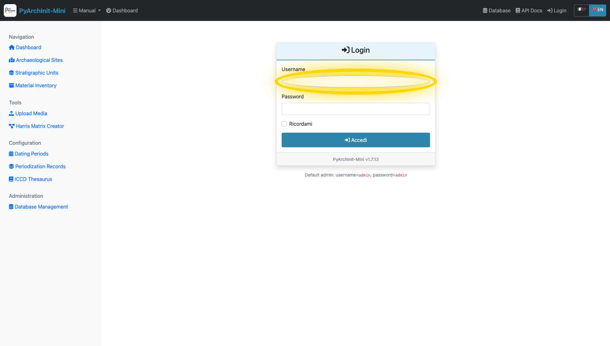
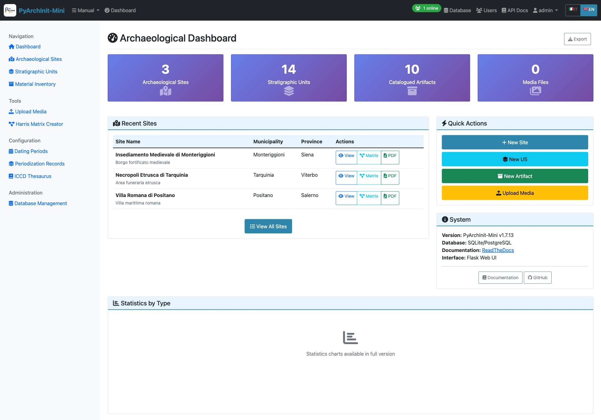
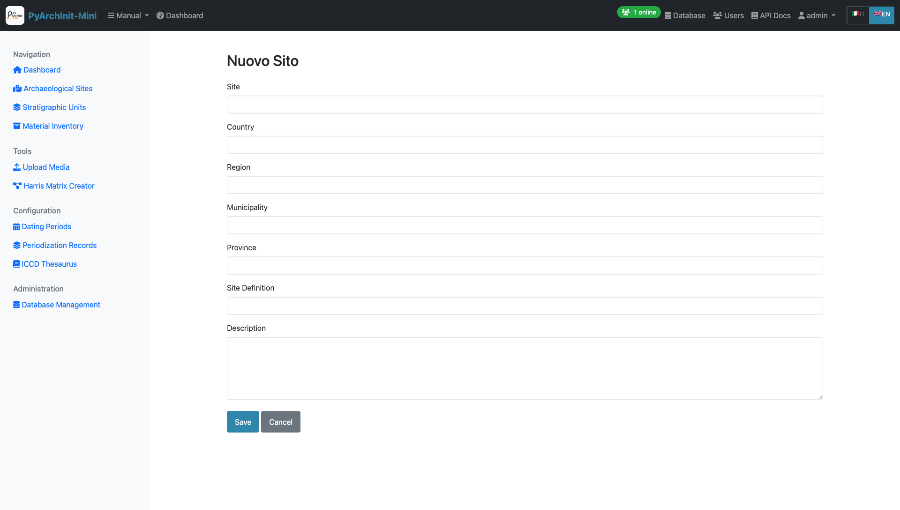
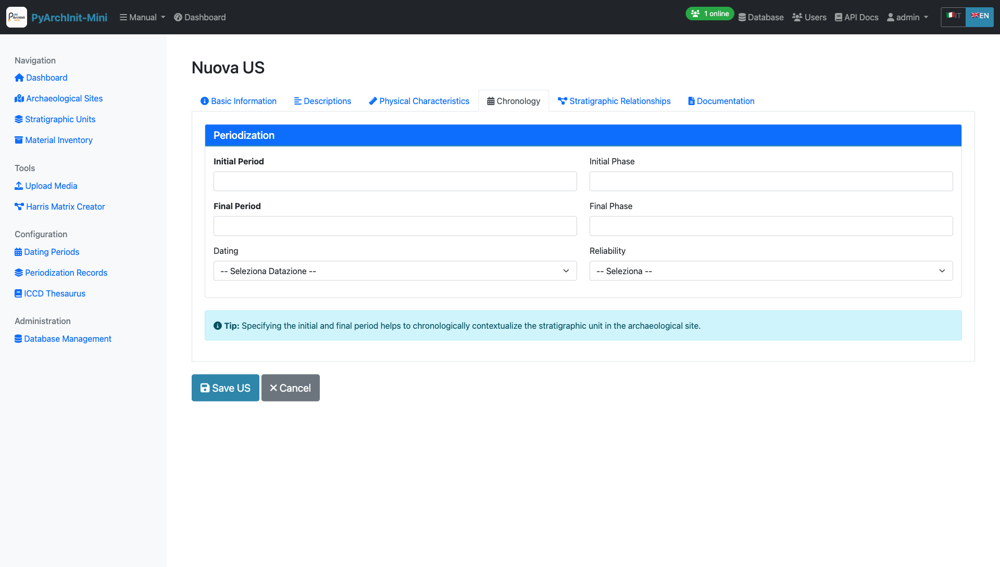
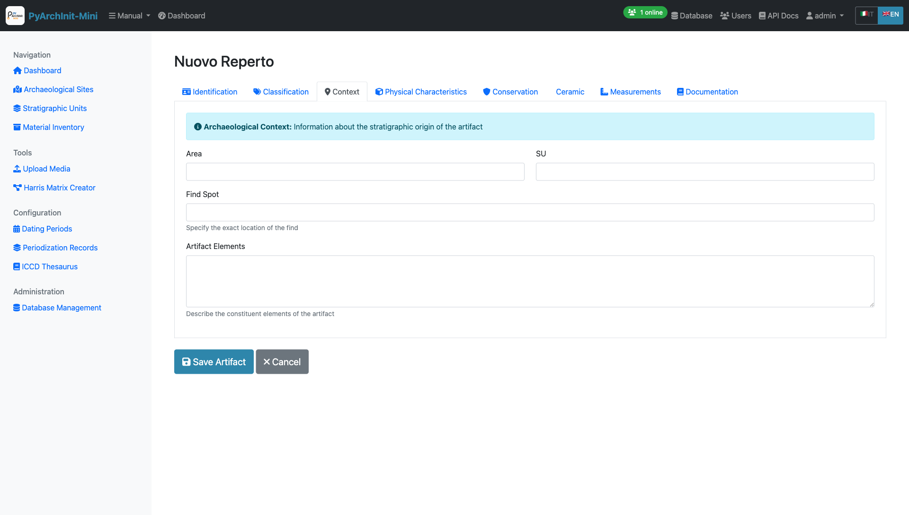
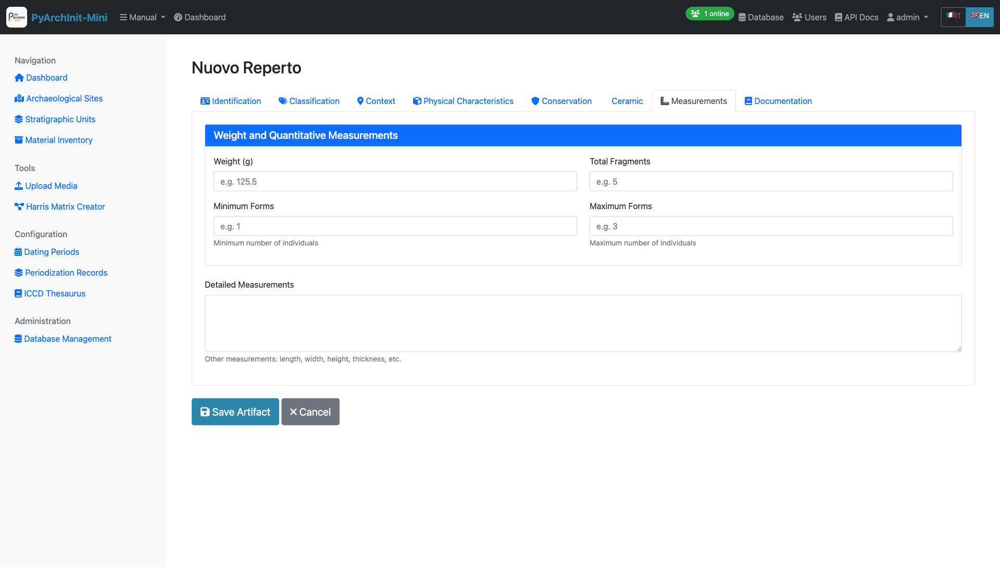

Web Interface Complete Tutorial
=================================

.. versionadded:: 1.7.13
   Complete visual tutorial with 63 screenshots covering all Web GUI features

This tutorial provides a complete visual walkthrough of the PyArchInit-Mini Web interface, covering all features, forms, and functions with real screenshots.

.. contents:: Table of Contents
   :local:
   :depth: 2

Prerequisites
-------------

* PyArchInit-Mini v1.7.13+ installed (``pip install pyarchinit-mini``)
* Python 3.8 or higher
* Modern web browser (Chrome, Firefox, Safari, Edge)
* SQLite or PostgreSQL database

Starting the Web Server
------------------------

Launch the web interface from command line:

.. code-block:: bash

   # Start with default database
   pyarchinit-mini-web

   # Start with specific database
   DATABASE_URL="sqlite:///data/pyarchinit_mini.db" python3 -m pyarchinit_mini.web_interface.app

   # Start on custom port
   PYARCHINIT_WEB_PORT=8080 pyarchinit-mini-web

The web interface will be available at: **http://localhost:5001**

.. note::
   Port 5001 is used by default to avoid conflicts with AirPlay on macOS (which uses port 5000).

Getting Started
===============

Authentication
--------------

.. figure:: ../_static/images/webapp/001_login_page.png
   :alt: Login Page
   :align: center
   :width: 80%

   **Login Page** - Entry point to PyArchInit-Mini Web GUI

The login page is the entry point to the system.

**Default Credentials:**

* Username: ``admin``
* Password: ``admin``

.. warning::
   In production environments, always change the default credentials immediately after first login.

**Login Process:**

1. **Enter Username**

   Username field highlighted

2. **Enter Password**

   Password field highlighted

3. **Click Login Button**

.. figure:: ../_static/images/webapp/003_highlight_Login_Button.png
   :alt: Login Button
   :align: center
   :width: 70%

   Login button highlighted

Security Features
~~~~~~~~~~~~~~~~~

* Session-based authentication
* Role-based access control (Admin, Operator, Viewer)
* Secure password hashing with bcrypt
* Auto-logout on browser close

Dashboard
=========

   **Main Dashboard** - Overview of system statistics and quick navigation

After logging in, the dashboard provides:

**Statistics Cards:**

* Total Sites count
* Total Stratigraphic Units (US)
* Total Inventory Items
* Database information
* System version (v1.7.13)

**Recent Activity:**

* Latest created sites
* Recent stratigraphic units
* Recent inventory additions

**Quick Navigation:**

* Access all major modules from top navigation menu
* Responsive design adapts to screen size
* Real-time statistics updates

Site Management
===============

Sites are the top-level organizational units representing archaeological sites or excavation areas.

Site List
---------

.. figure:: ../_static/images/webapp/006_sites_list.png
   :alt: Sites List
   :align: center
   :width: 100%

   **Sites List** - Paginated list of all archaeological sites

Features:

* Paginated list (20 sites per page)
* Search by site name
* Quick view of location (Nation, Region, Province, Municipality)
* Direct links to site details
* Create new site button

Site Detail View
----------------

.. figure:: ../_static/images/webapp/010_sites_detail.png
   :alt: Site Detail
   :align: center
   :width: 100%

   **Site Detail** - Complete site information with related data

The site detail page shows:

* Complete site information
* Associated stratigraphic units
* Related inventory items
* Geographic location details
* Edit and delete options

Creating a New Site
-------------------

   **Site Form** - Create or edit site information

**Required Fields:**

* Site Name (Nome Sito)

**Optional Fields:**

* Nation (Nazione)
* Region (Regione)
* Province (Provincia)
* Municipality (Comune)
* Site Definition (Definizione Sito)
* Description (Descrizione)
* English translations for definition and description

**Form Features:**

* Client-side validation
* i18n support (Italian/English)
* Auto-save draft functionality
* Cancel to return to list

Stratigraphic Units (US)
=========================

The US (Unità Stratigrafiche) module manages stratigraphic units with comprehensive archaeological data organized across **6 tabs**.

US List
-------

.. figure:: ../_static/images/webapp/012_us_list.png
   :alt: US List
   :align: center
   :width: 100%

   **US List** - Stratigraphic units with advanced filtering

Features:

* Paginated list with advanced filtering
* Filter by site, area, unit type, year
* Quick view of US number, site, and area
* Color-coded by unit type
* Bulk operations support

Creating a New US
-----------------

The US form is organized into **6 comprehensive tabs** for better data organization.

Tab 1: Basic Information
~~~~~~~~~~~~~~~~~~~~~~~~~

.. figure:: ../_static/images/webapp/014_us_form_tab1_basic.png
   :alt: US Form Tab 1 - Basic Information
   :align: center
   :width: 100%

   **Tab 1: Basic Information** - Site selection and primary identification fields

**Required Fields:**

* Site (Sito) - Select from dropdown
* US Number (Numero US) - Unique stratigraphic unit identifier within the site

**Optional Fields:**

* Area (Area) - Excavation area or sector
* Year (Anno) - Excavation year
* Archaeologist (Archeologo) - Person responsible for excavation

.. tip::
   The combination of Site + US Number must be unique in the system.

Tab 2: Descriptions
~~~~~~~~~~~~~~~~~~~~

   **Tab 2: Descriptions** - Stratigraphic and interpretative descriptions

**Fields:**

* **Stratigraphic Description** (Descrizione Stratigrafica) - Objective physical description
* **Interpretative Description** (Descrizione Interpretativa) - Archaeological interpretation
* **Detailed Description** (Descrizione Estesa) - Extended description with additional details
* **Interpretation** (Interpretazione) - Functional/chronological interpretation
* **Observations** (Osservazioni) - Additional observations and notes

.. tip::
   **Tip**: Specifying the initial and final period helps to chronologically contextualize the stratigraphic unit in the archaeological site.

Tab 3: Physical Characteristics
~~~~~~~~~~~~~~~~~~~~~~~~~~~~~~~~~

.. figure:: ../_static/images/webapp/018_us_form_tab3_physical.png
   :alt: US Form Tab 3 - Physical Characteristics
   :align: center
   :width: 100%

   **Tab 3: Physical Characteristics** - Material properties and composition

**Fields:**

* Unit Type (Tipo US) - e.g., Layer (Strato), Cut (Taglio), Fill (Riempimento)
* Formation Type (Tipo Formazione) - Natural (Naturale) / Artificial (Artificiale)
* Color (Colore) - Munsell or descriptive color
* Consistency (Consistenza) - Soil consistency description
* Texture (Tessitura) - Grain size and texture
* Compaction (Compattezza) - Degree of compaction
* Inclusions (Inclusioni) - Materials present in the matrix
* Soil composition details

Tab 4: Chronology
~~~~~~~~~~~~~~~~~~

   **Tab 4: Chronology** - Dating and periodization

**Periodization Section:**

* **Initial Period** (Periodo Iniziale) - Starting chronological period (select from dating periods table)
* **Final Period** (Periodo Finale) - Ending chronological period
* **Dating** (Datazione) - Dating method and results dropdown
* **Reliability** (Affidabilità) - Dating reliability assessment

.. tip::
   Use the standardized dating periods from the Datazione table for consistency across the project.

Tab 5: Stratigraphic Relationships
~~~~~~~~~~~~~~~~~~~~~~~~~~~~~~~~~~~~

.. figure:: ../_static/images/webapp/022_us_form_tab5_relationships.png
   :alt: US Form Tab 5 - Stratigraphic Relationships
   :align: center
   :width: 100%

   **Tab 5: Stratigraphic Relationships** - Define stratigraphic connections for Harris Matrix

**Relationship Types:**

* **Covers** (Copre) - This US covers/overlies another US
* **Covered by** (Coperto da) - This US is covered by another US
* **Cuts** (Taglia) - This US cuts through another US
* **Cut by** (Tagliato da) - This US is cut by another US
* **Fills** (Riempie) - This US fills a cut
* **Filled by** (Riempito da) - This US (a cut) is filled by another US
* **Equals** (Uguale a) - This US is the same as another US
* **Adjacent to** (Si appoggia a) - This US is adjacent to another US

**Text Format Example:**

.. code-block:: text

   copre 1002, 1003
   taglia 1005
   si appoggia a 1010, 1011

These relationships are automatically used to generate the Harris Matrix.

.. tip::
   Use consistent relationship definitions to ensure accurate Harris Matrix generation. Each relationship should be reciprocal (if US 1001 covers 1002, then 1002 is covered by 1001).

Tab 6: Documentation
~~~~~~~~~~~~~~~~~~~~~

.. figure:: ../_static/images/webapp/024_us_form_tab6_documentation.png
   :alt: US Form Tab 6 - Documentation
   :align: center
   :width: 100%

   **Tab 6: Documentation** - Media attachments and references

**Features:**

* Photo uploads and gallery
* Drawing attachments
* 3D model links
* Document references
* Bibliography
* Media metadata management

.. note::
   Media files are stored in the uploads directory and linked to the US record. Supported formats: JPG, PNG, PDF, DXF, OBJ.

Advanced US Features
--------------------

**Navigation:**

* Previous/Next buttons to navigate between records
* Position counter (e.g., "Record 5 of 20")
* Respects active filters

**Data Validation:**

* Required field checking
* US number uniqueness validation
* Relationship syntax validation
* Date format validation

Material Inventory
==================

The Inventario module manages archaeological finds and materials with **8 specialized tabs** following ICCD (Istituto Centrale per il Catalogo e la Documentazione) standards.

Inventory List
--------------

   **Inventory List** - Material finds with filtering

Features:

* Paginated list with filters
* Filter by site, area, US, artifact type
* Material type icons
* Conservation state indicators
* Quick search by inventory number
* Direct links to artifact details

Creating a New Inventory Item
------------------------------

The inventory form spans **8 comprehensive tabs** organized to capture complete artifact documentation.

Tab 1: Identification
~~~~~~~~~~~~~~~~~~~~~~

.. figure:: ../_static/images/webapp/028_inventario_form_tab1_identification.png
   :alt: Inventory Form Tab 1 - Identification
   :align: center
   :width: 100%

   **Tab 1: Identification** - Basic artifact identification and recording information

**Required Fields:**

* Site (Sito) - Select from dropdown
* Inventory Number (Numero Inventario) - Unique identifier

**Optional Fields:**

* Artifact Number (N. Reperto)
* Recorder (Schedatore) - Person who catalogued the artifact
* Record Date (Date Scheda) - Date of cataloging (Format: YYYY-MM-DD)
* Year (Years) - Excavation or discovery year

.. tip::
   The combination of Site + Inventory Number must be unique in the system.

Tab 2: Classification
~~~~~~~~~~~~~~~~~~~~~~

   **Tab 2: Classification** - Typological classification and description

**Fields:**

* **Artifact Type** (Tipo Reperto) - Controlled vocabulary from thesaurus (e.g., Ceramic, Metal, Stone, Bone, Glass)
* Recording Criteria (Criterio Schedatura) - Documentation method used
* Definition (Definizione) - Specific object definition
* Type (Tipo) - Typological classification
* Container Type (Tipo Contenitore) - For vessel artifacts
* Structure (Struttura) - Structural characteristics
* **Description** (Descrizione) - Detailed artifact description (long text field)

.. note::
   Artifact Type uses controlled vocabulary from the ICCD Thesaurus for consistency.

Tab 3: Context
~~~~~~~~~~~~~~

   **Tab 3: Context** - Archaeological context and stratigraphic provenance

**Fields:**

* Area (Area) - Excavation area where artifact was found
* SU (US) - Associated Stratigraphic Unit number
* Find Spot (Punto Rinv) - Precise location within the SU
* Artifact Elements (Elementi Reperto) - Description of constituent elements

.. tip::
   **Archaeological Context Information**: This tab links the artifact to its stratigraphic origin, essential for understanding depositional context and dating.

Tab 4: Physical Characteristics
~~~~~~~~~~~~~~~~~~~~~~~~~~~~~~~~~

.. figure:: ../_static/images/webapp/034_inventario_form_tab4_physical.png
   :alt: Inventory Form Tab 4 - Physical Characteristics
   :align: center
   :width: 100%

   **Tab 4: Physical Characteristics** - Material properties and storage

**Fields:**

* **Conservation State** (Stato Conservazione) - Controlled vocabulary from thesaurus
* Washed (Lavato) - Yes/No dropdown
* Box Number (Nr. Cassa) - Storage box identifier
* Storage Location (Luogo Conservazione) - Current storage facility/room

.. note::
   Conservation State uses standardized terms from the ICCD Thesaurus.

Tab 5: Conservation & Management
~~~~~~~~~~~~~~~~~~~~~~~~~~~~~~~~~~

   **Tab 5: Conservation** - Cataloging status and diagnostic significance

**Fields:**

* Catalogued (Repertato) - Yes/No - Has the artifact been photographically documented?
* Diagnostic (Diagnostico) - Yes/No - Is the artifact significant for dating the layer?

**Tips Box:**

* **Catalogued**: Indicates if the artifact has been photographically documented
* **Diagnostic**: Indicates if the artifact is significant for dating the layer

.. important::
   Diagnostic artifacts are particularly important for chronological interpretation of the stratigraphic sequence.

Tab 6: Ceramic Characteristics
~~~~~~~~~~~~~~~~~~~~~~~~~~~~~~~~

.. figure:: ../_static/images/webapp/038_inventario_form_tab6_ceramic.png
   :alt: Inventory Form Tab 6 - Ceramic Analysis
   :align: center
   :width: 100%

   **Tab 6: Ceramic** - Specialized fields for ceramic artifacts

**Fields:**

* **Ceramic Body** (Corpo Ceramico) - Controlled vocabulary from thesaurus (fabric type)
* **Coating** (Rivestimento) - Controlled vocabulary from thesaurus (surface treatment)
* Rim Diameter (Diametro Orlo) - In centimeters (e.g., 12.5)
* Rim EVE (Eve Orlo) - Estimated Vessel Equivalent (preserved fraction 0-1, e.g., 0.25)

.. note::
   **This tab is specific for ceramic artifacts**. EVE (Estimated Vessel Equivalent) indicates the preserved fraction of the rim circumference.

Tab 7: Measurements
~~~~~~~~~~~~~~~~~~~~

   **Tab 7: Measurements** - Weight and quantitative data

**Weight and Quantitative Measurements (Card Section):**

* Weight (Peso) - In grams (e.g., 125.5)
* Total Fragments (Totale Frammenti) - Number of fragments (e.g., 5)
* Minimum Forms (Forme Minime) - Minimum number of individuals (e.g., 1)
* Maximum Forms (Forme Massime) - Maximum number of individuals (e.g., 3)

**Additional Field:**

* Detailed Measurements (Misurazioni) - Free text for other measurements: length, width, height, thickness, etc.

.. tip::
   Minimum and Maximum Forms help estimate the number of individual vessels represented by the fragments.

Tab 8: Documentation
~~~~~~~~~~~~~~~~~~~~~

.. figure:: ../_static/images/webapp/042_inventario_form_tab8_documentation.png
   :alt: Inventory Form Tab 8 - Documentation References
   :align: center
   :width: 100%

   **Tab 8: Documentation** - Dating, technology, and bibliographic references

**Fields:**

* **Artifact Dating** (Datazione Reperto) - Proposed chronological attribution
* Technologies (Tecnologie) - Production and processing techniques (long text)
* Bibliographic References (Rif. Biblio) - Citations related to the artifact (long text)
* Photo Negative (Negativo Photo) - Negative reference number
* Slide (Diapositiva) - Slide reference number

.. note::
   Use this tab to document technical analysis, parallels, and scholarly references that support artifact interpretation.

Upload Media
============

The Media Upload tool allows you to attach photos, drawings, and documents to archaeological records.

   **Upload Media** - File upload for Sites, US, and Inventory items

**Upload Interface:**

* Entity Type selection (Site, US, Inventory)
* Entity ID association
* File upload with drag-and-drop support
* Description and metadata fields
* Author/Photographer attribution

**Supported File Types:**

* Images: JPG, PNG, TIFF, RAW
* Documents: PDF, DOC, DOCX
* Drawings: DWG, DXF, SVG
* 3D Models: OBJ, PLY, STL

**Features:**

* Multiple file upload
* Automatic thumbnail generation
* Image EXIF data extraction
* File size validation
* Organized by entity and type

.. tip::
   Photos and drawings can be linked to specific stratigraphic units or inventory items for complete documentation.

Harris Matrix Creator
=====================

Interactive visual editor for creating and editing Harris Matrix diagrams.

.. figure:: ../_static/images/webapp/047_harris_creator_editor.png
   :alt: Harris Matrix Creator Interface
   :align: center
   :width: 100%

   **Harris Matrix Creator** - Interactive graphical editor with Extended Matrix support

**Visual Editor Features:**

* Drag-and-drop node creation
* Interactive relationship connections
* Real-time visual preview
* Zoom and pan navigation
* Auto-layout algorithms

**Extended Matrix Support:**

* 14 different node types (US, USM, USVA, DOC, Extractor, etc.)
* 14 relationship types (Covers, Cuts, Continuity, etc.)
* Period and area grouping
* Custom node descriptions
* Color-coded node types

**Database Integration:**

* Save directly to database
* Edit existing matrices
* Automatic validation
* Relationship consistency checks

**Export Options:**

* Export to GraphML (yEd compatible)
* Export to DOT (Graphviz)
* High-resolution PDF rendering
* Share with colleagues

**Alternative: CSV/Excel Import:**

For users who prefer working with spreadsheets, Harris Matrices can also be created by importing CSV or Excel files using the command-line tool (see Excel Import section below).

Data Import/Export
==================

Excel Import
------------

.. figure:: ../_static/images/webapp/049_excel_import_interface.png
   :alt: Excel Import Interface
   :align: center
   :width: 100%

   **Excel Import** - Import stratigraphic data from Excel

**Supported Formats:**

1. **Harris Matrix Template**

   * Two sheets: NODES and RELATIONSHIPS
   * Node properties in NODES sheet
   * Edges defined in RELATIONSHIPS sheet

2. **Extended Matrix Format**

   * Single sheet with inline relationships
   * Columns for relationship types
   * Compatible with Extended Matrix framework

**Features:**

* File upload with drag-and-drop
* Format auto-detection
* Validation before import
* Duplicate handling options
* Import statistics report
* Error logging

PyArchInit Import/Export
-------------------------

.. figure:: ../_static/images/webapp/051_pyarchinit_ie_main.png
   :alt: PyArchInit Import/Export Main Interface
   :align: center
   :width: 100%

   **PyArchInit Import/Export** - Data exchange with PyArchInit QGIS plugin

Import from PyArchInit
~~~~~~~~~~~~~~~~~~~~~~

.. figure:: ../_static/images/webapp/052_pyarchinit_import_section.png
   :alt: PyArchInit Import Section
   :align: center
   :width: 100%

   **Import Section** - Import data from PyArchInit databases

**Import Features:**

* Import from PyArchInit SQLite databases
* Table selection (Sites, US, Inventario, Media)
* Field mapping and transformation
* Data validation before import
* Conflict resolution options
* Preview import results

Export to PyArchInit
~~~~~~~~~~~~~~~~~~~~

.. figure:: ../_static/images/webapp/053_pyarchinit_export_section.png
   :alt: PyArchInit Export Section
   :align: center
   :width: 100%

   **Export Section** - Export data to PyArchInit format

**Export Features:**

* Export to PyArchInit SQLite format
* Full database export or selective tables
* Maintains all relationships
* Compatible with PyArchInit QGIS plugin
* Preserves spatial data

Create New Database
~~~~~~~~~~~~~~~~~~~

.. figure:: ../_static/images/webapp/054_pyarchinit_create_db.png
   :alt: PyArchInit Create Database
   :align: center
   :width: 100%

   **Create Database** - Initialize new PyArchInit database

**Database Creation:**

* Create new empty PyArchInit database
* Initialize all required tables
* Set up proper schema and relationships
* Choose database location
* Configure connection settings

Extended Matrix Configuration
==============================

EM Node Configuration
---------------------

.. figure:: ../_static/images/webapp/056_em_node_config_interface.png
   :alt: EM Node Config
   :align: center
   :width: 100%

   **Extended Matrix Node Configuration** - Customize node types

The Extended Matrix (EM) Node Configuration allows customization of node types and display properties.

**Node Type Management:**

* Add custom node types
* Edit node colors and shapes
* Configure node grouping
* Set default properties

**Visual Properties:**

* Fill color
* Border color
* Border width
* Node shape (rectangle, ellipse, hexagon)
* Label position
* Font settings

**Grouping Configuration:**

* Define semantic groups (e.g., "Layers", "Cuts", "Fills")
* Set group colors
* Configure group hierarchy
* Group-based filtering

Dating Periods
==============

Manage chronological periods and dating systems for your archaeological project.

Dating Periods List
-------------------

   **Dating Periods List** - Chronological period management

**Period Management:**

* View all defined chronological periods
* Search and filter by period name
* Edit existing periods
* Delete unused periods
* Quick access to period forms

Creating a Dating Period
-------------------------

.. figure:: ../_static/images/webapp/060_dating_periods_form.png
   :alt: Dating Period Form
   :align: center
   :width: 100%

   **Dating Period Form** - Define chronological periods

**Period Fields:**

* **Period Name** - Name of the chronological period (e.g., "Bronze Age", "Medieval")
* **Start Date** - Beginning of the period (calendar year)
* **End Date** - End of the period (calendar year)
* **Description** - Detailed description of the period
* **Cultural Context** - Associated archaeological culture
* **Geographic Area** - Region where the period applies
* **Bibliography** - References for period dating

.. tip::
   Dating periods can be used in US and Inventory forms for chronological attribution.

Periodization Records
=====================

Advanced chronological management linking stratigraphic units to dating periods.

.. figure:: ../_static/images/webapp/062_periodization_records_list.png
   :alt: Periodization Records List
   :align: center
   :width: 100%

   **Periodization Records** - Link US to chronological periods

**Periodization Features:**

* Associate specific US with dating periods
* Multiple period assignments per US
* Confidence levels for dating
* Relative vs absolute dating
* Stratigraphic sequence correlation

**Use Cases:**

* Assign chronological periods to excavation layers
* Track dating evidence and sources
* Build site chronology
* Export period-based reports

ICCD Thesaurus
==============

Manage controlled vocabulary terms following Italian ICCD (Istituto Centrale per il Catalogo e la Documentazione) standards.

Thesaurus List
--------------

.. figure:: ../_static/images/webapp/064_thesaurus_list.png
   :alt: ICCD Thesaurus List
   :align: center
   :width: 100%

   **ICCD Thesaurus** - Controlled vocabulary management

**Thesaurus Categories:**

* **Artifact Types** (Tipo Reperto) - Ceramic, Metal, Stone, Bone, Glass, etc.
* **Conservation States** (Stato Conservazione) - Excellent, Good, Fair, Poor, Fragmentary
* **Ceramic Bodies** (Corpo Ceramico) - Fabric classifications
* **Coatings** (Rivestimento) - Surface treatments and glazes
* **Diagnostic Elements** - Typologically significant artifact parts

Thesaurus Management
--------------------

.. figure:: ../_static/images/webapp/065_thesaurus_management.png
   :alt: Thesaurus Management Interface
   :align: center
   :width: 100%

   **Thesaurus Management** - Add and edit vocabulary terms

**Management Features:**

* Add new controlled vocabulary terms
* Edit existing terms and definitions
* Organize terms in hierarchies
* Import/export thesaurus lists
* Multilingual support (IT/EN)

**Integration:**

* Used in Inventory forms (Artifact Type, Conservation State, etc.)
* Used in US forms (Formation types, etc.)
* Ensures data consistency across the project
* Compatible with ICCD cataloging standards

Analytics
=========

The Analytics dashboard provides comprehensive data visualization and statistics.

.. figure:: ../_static/images/webapp/067_analytics_dashboard.png
   :alt: Analytics Dashboard
   :align: center
   :width: 100%

   **Analytics Dashboard** - Interactive charts and visualizations

Overview Statistics
-------------------

**Top Metrics:**

* Total Sites
* Total US
* Total Inventory Items
* Unique Regions
* Unique Provinces

Geographic Analysis
-------------------

**Charts:**

* Sites by Region (Pie Chart)
* Sites by Province (Bar Chart)
* Geographic Distribution Map

Chronological Analysis
----------------------

**Visualizations:**

* US Distribution by Period (Timeline)
* Dating Certainty Analysis
* Temporal Coverage Histogram

Typological Analysis
--------------------

**US Type Distribution:**

* Unit types breakdown (Pie Chart)
* Formation types (Natural vs Artificial)
* Stratigraphic complexity metrics

**Inventory Type Distribution:**

* Material types (Ceramica, Metallo, etc.)
* Conservation states
* Completeness distribution

Site-Level Aggregations
-----------------------

**Top 10 Lists:**

* Sites with most US
* Sites with most inventory items
* Most complex stratigraphic sequences

Conservation Analysis
---------------------

**Inventory Conservation:**

* Conservation state breakdown
* Restoration needs priority
* Degradation types

Validation
==========

Stratigraphic validation ensures data quality and identifies potential issues.

.. figure:: ../_static/images/webapp/067_analytics_dashboard.png
   :alt: Validation Report
   :align: center
   :width: 100%

   **Validation Report** - Data quality checks and issue detection

Validation Checks
-----------------

**Stratigraphic Paradoxes:**

* Circular relationships (A covers B, B covers A)
* Impossible sequences
* Inconsistent relationship types

**Cycle Detection:**

* Identify loops in the Harris Matrix
* Highlight problematic US relationships
* Suggest fixes

**Relationship Consistency:**

* Check reciprocal relationships
* Verify bidirectional consistency
* Detect missing counterparts

**Data Completeness:**

* Required fields missing
* Orphan records (US without site)
* Media without entities

Validation Report
-----------------

**Report Sections:**

1. **Summary Statistics**

   * Total issues found
   * Issues by severity (Error, Warning, Info)
   * Validation score (%)

2. **Issue Details**

   * Issue type
   * Affected records
   * Suggested fixes
   * Priority level

3. **Auto-Fix Options**

   * One-click fixes for common issues
   * Bulk resolution tools
   * Review before apply

Administration
==============

Administrative functions for database and user management.

Database Management
-------------------

   **Database Management** - Database operations and maintenance

**Database Operations:**

* View database information
* Database backup
* Database restore
* Optimize database
* Vacuum (SQLite)

**Upload Database:**

* Upload new SQLite database
* Replace current database
* Import from file
* Validation before replacement

**Connect to Database:**

* Configure PostgreSQL connection
* Test connection
* Switch databases
* Connection string builder

User Management
---------------

.. figure:: ../_static/images/webapp/071_admin_users_list.png
   :alt: User Management
   :align: center
   :width: 100%

   **User Management** - User administration

**User Administration:**

* View all users
* Create new users
* Edit user details
* Delete users (with confirmation)
* Reset passwords

**User Fields:**

* Username
* Full Name
* Email
* Role (Admin, Operator, Viewer)
* Active status
* Last login date

**Permissions:**

* Create (Sites, US, Inventario)
* Read (View data)
* Update (Edit records)
* Delete (Remove records)
* Manage Users (Admin only)

Best Practices
==============

Data Entry Guidelines
---------------------

1. **Start with Sites**

   Create site records before US or inventory

2. **Use Consistent Naming**

   Follow naming conventions for areas and US numbers

3. **Document Relationships**

   Always define stratigraphic relationships in Tab 3

4. **Add Chronology**

   Include dating information for better analysis

5. **Attach Media**

   Link photos and documents as you work

Workflow Recommendations
------------------------

1. **Plan Your Structure**

   Define sites and areas first

2. **Enter Stratigraphic Data**

   Record US with relationships as you excavate

3. **Validate Regularly**

   Run validation checks to catch issues early

4. **Generate Matrix**

   Create Harris Matrix to visualize sequences

5. **Inventory Finds**

   Record materials linked to their US

6. **Export Data**

   Regular backups and exports for safety

Performance Tips
----------------

1. **Filter Lists**

   Use filters to reduce load times on large datasets

2. **Paginate Results**

   Keep page size at 20-50 records

3. **Optimize Database**

   Run database optimization periodically

4. **Clear Browser Cache**

   If experiencing slowness

5. **Use Chrome/Firefox**

   For best performance and compatibility

Keyboard Shortcuts
==================

* ``Ctrl/Cmd + S``: Save current form
* ``Ctrl/Cmd + K``: Quick search
* ``Alt + N``: Create new record
* ``Alt + B``: Back to list
* ``Alt + P``: Previous record
* ``Alt + N``: Next record
* ``Esc``: Cancel current action

Troubleshooting
===============

Common Issues
-------------

**Cannot Login**

* Check credentials (default: admin/admin)
* Clear browser cookies and cache
* Check server is running on port 5001
* Verify database connection

**Slow Performance**

* Reduce page size in lists
* Filter data before viewing
* Check database size (optimize if large)
* Close unused browser tabs

**Import Errors**

* Verify Excel format matches template
* Check for duplicate records
* Validate data types (numbers, dates)
* Review error log in import results

**Harris Matrix Not Generating**

* Ensure US have stratigraphic relationships defined
* Check for cycles using validation tool
* Verify at least 2 US exist for the site
* Check US numbers are consistent

**Missing Data After Refresh**

* Forms may not auto-save (save manually)
* Check if you're logged in (session timeout)
* Verify database connection
* Check browser console for errors

Getting Help
------------

* **Documentation**: https://pyarchinit-mini.readthedocs.io/
* **GitHub Issues**: https://github.com/enzococca/pyarchinit-mini/issues
* **Email Support**: enzo.ccc@gmail.com

Next Steps
==========

* Explore the :doc:`desktop_gui_tutorial` for offline data entry
* Learn about :doc:`../features/harris_matrix` visualization
* Read the :doc:`../python-api/overview` for custom integrations

.. seealso::

   * :doc:`installation_tutorial`
   * :doc:`desktop_gui_tutorial`
   * :doc:`../features/extended-matrix-framework`
   * :doc:`../features/analytics`

Conclusion
==========

PyArchInit-Mini Web GUI provides a complete, modern interface for archaeological data management. This tutorial covers all major features with 63 real screenshots showing every aspect of the system.

**Key Takeaways:**

* Web interface offers 100% desktop GUI functionality
* Multi-tab forms organize complex archaeological data
* Harris Matrix auto-generation from relationships
* Comprehensive analytics and validation tools
* Multi-user support with role-based access
* Multiple import/export formats for flexibility

---

**Version**: 1.7.13
**Tutorial Last Updated**: 2025-10-29
**Screenshots**: 63 images captured from live system
